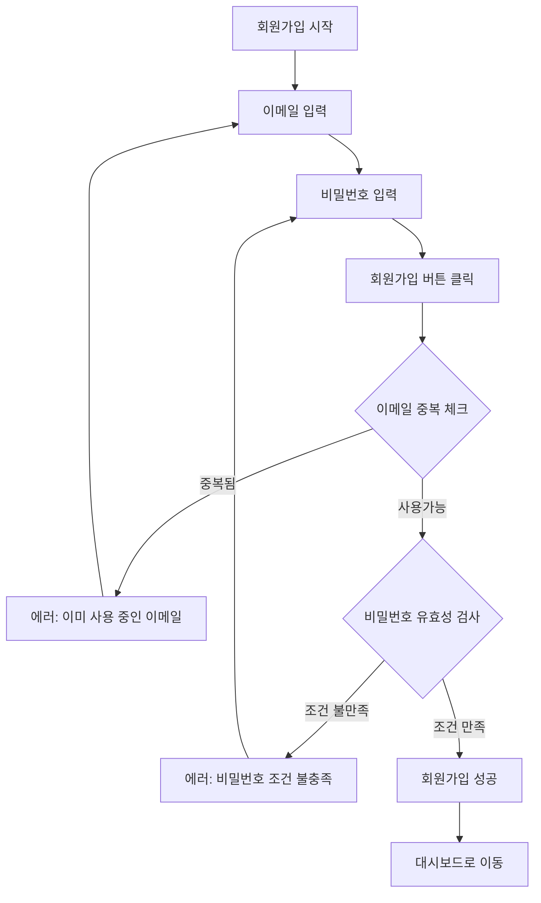

# 기획서 템플릿

## ⚠️ 기획 시작 전 필수 확인사항
**기획자 AI는 기획서 작성 전 반드시 다음 문서를 읽어야 합니다:**
1. **`be/instructions/ticket-numbers.json`** - 현재 티켓 번호 확인 (다음 번호 사용)
2. **`be/instructions/commit-guidelines.md`** - 티켓 채번 규칙 (FT/PM 코드, Epic/Story 구조)
3. **`be/instructions/workflow/ai-collaboration-workflow.md`** - 협업 워크플로우

**채번 규칙과 현재 번호를 확인하지 않고 기획서를 작성하는 것은 금지됩니다.**

---

## 문서 정보
- **프로젝트명**: [프로젝트 이름]
- **작성일**: [YYYY-MM-DD]
- **버전**: v1.0
- **작성자**: 기획자 AI

---

## 1. 목표 및 배경 (Why)

### 1.1 프로젝트 목적
**나쁜 예시**: "회원가입 기능 개선"

**좋은 예시**: "회원가입 과정을 3단계에서 2단계로 줄여 사용자 이탈율을 20% 감소시키고 전환율을 15% 높이는 것이 목표"

```
[구체적인 목표 작성란]
- 해결하려는 문제: 
- 기대 효과 (정량적):
- 기대 효과 (정성적):
```

### 1.2 배경 및 현황
```
[현재 상황 및 문제점]
- 현재 상황:
- 발견된 문제:
- 개선 필요성:
```

---

## 2. 사용자 흐름 (User Flow)

### 2.1 주요 사용자 여정
**나쁜 예시**: "사용자가 회원가입을 진행하고 완료함"

**좋은 예시**:
```
1. 사용자가 '회원가입' 버튼을 클릭한다.
2. 이메일과 비밀번호를 입력한다.
3. 사용자가 이메일을 입력한 후, '다음' 버튼을 클릭하면 서버에서 이메일 중복 여부를 확인한다.
4. 중복된 이메일이 있을 경우 '이미 사용 중인 이메일입니다' 메시지를 띄운다.
5. 비밀번호는 8자 이상, 대문자와 숫자를 포함해야 한다.
6. 조건을 만족하지 않으면 '비밀번호 조건을 충족해 주세요' 메시지가 뜬다.
7. 모든 정보가 올바르게 입력되면 '회원가입이 완료되었습니다' 메시지와 함께 대시보드로 이동한다.
```

### 2.2 Mermaid 플로우차트


**플로우차트 작성 가이드라인:**
- 모든 사용자 액션과 시스템 반응을 포함
- 성공/실패 케이스 모두 표현
- 에러 발생 시 복구 경로 명시

---

## 3. 기능 명세서

### 3.1 주요 기능 목록
1. **목표와 배경**: 왜 이 기능이 필요한지, 해결하려는 문제는 무엇인지 설명
2. **사용자 흐름**: 사용자가 기능을 어떻게 이용할지 구체적으로 설명  
3. **주요 기능 설명**: 각 기능이 어떻게 동작하는지 상세히 서술
4. **화면 설계**: 화면에 어떤 요소들이 배치될지 시각적으로 표현
5. **예외 처리 및 에러 메시지**: 오류 상황 발생 시 어떻게 처리할지 정리
6. **기술적 고려 사항**: API 연동이나 외부 서비스 통합 등의 부분 설명

### 3.2 기능별 상세 정의

#### 기능 1: [기능명]
**나쁜 예시**: "회원가입 기능 구현"

**좋은 예시**: "회원가입 기능 구현"
```
- 사용자가 이메일과 비밀번호를 입력하고 '회원가입' 버튼을 클릭하면, 입력된 정보가 서버로 전송된다.
- 서버는 이메일 중복 여부를 확인한다.
- 이메일이 중복일 경우, '이미 사용 중인 이메일입니다' 메시지를 띄우고 절차를 중단한다.
- 모든 정보가 유효하면 서버에서 회원가입 처리를 완료하고 로그인 페이지로 리디렉션 한다.
```

---

## 4. 화면 설계 (UI/UX 가이드라인)

### 4.1 텍스트 와이어프레임

#### 4.1.1 회원가입 화면
```
┌─────────────────────────────────────┐
│           [로고]                     │
│                                     │
│        회원가입                      │
│                                     │
│  이메일 주소 *                      │
│  ┌─────────────────────────────┐   │
│  │ example@email.com           │   │
│  └─────────────────────────────┘   │
│  [에러 메시지 영역]                  │
│                                     │
│  비밀번호 *                         │
│  ┌─────────────────────────────┐   │
│  │ ••••••••                    │   │
│  └─────────────────────────────┘   │
│  • 8자 이상, 대문자, 숫자 포함       │
│  [에러 메시지 영역]                  │
│                                     │
│     [회원가입] 버튼                  │
│                                     │
│  이미 계정이 있으신가요? [로그인]     │
│                                     │
└─────────────────────────────────────┘
```

#### 4.1.2 화면 구성 요소별 설명
```
상단 영역 (Header):
- 로고: 좌상단 또는 중앙 배치
- 진행 단계 표시기 (선택사항)

메인 영역 (Main Content):
- 페이지 제목: "회원가입" (중앙 정렬, 큰 폰트)
- 입력 폼:
  * 이메일 입력란: 플레이스홀더 "example@email.com"
  * 비밀번호 입력란: 마스킹 처리 (••••••••)
  * 각 입력란 하단에 에러 메시지 표시 영역
- 비밀번호 조건 안내: 입력란 바로 아래 작은 텍스트
- 회원가입 버튼: 폼 하단, 전체 너비 또는 중앙 정렬

하단 영역 (Footer):
- 로그인 링크: "이미 계정이 있으신가요? 로그인"
- 약관 동의 체크박스 (필요시)
```

### 4.2 기본 요구사항
```
- 반응형 디자인: 모바일/태블릿/데스크톱 모든 디바이스 대응
- 접근성: 웹 표준 접근성 가이드라인(WCAG) 준수
- 사용성: 직관적이고 사용하기 쉬운 인터페이스
- 브랜드 일관성: 기존 디자인 시스템과 조화
```

**주의**: 세부적인 인터랙션, 반응형 브레이크포인트, 접근성 구현 방법 등은 `design-guidelines.md` 참고

---

## 5. 예외 처리 및 에러 메시지

### 5.1 예외 상황 정의
**나쁜 예시**: "로그인 실패 시 에러 메시지 표시"

**좋은 예시**:
```
- 로그인 실패 시: '아이디 또는 비밀번호가 잘못되었습니다' 메시지 표시
- 비밀번호 5회 이상 오류 시: '비밀번호를 5회 이상 틀렸습니다. 비밀번호 재설정 링크를 보내드릴까요?' 메시지 표시 후 이메일 전송
- 서버 응답 시간 초과 시: '서버 응답이 지연되고 있습니다. 잠시 후 다시 시도해 주세요' 메시지 표시
```

### 5.2 에러 메시지 가이드라인
- 사용자 친화적인 언어 사용
- 해결 방법 제시
- 일관된 톤앤매너 유지

---

## 6. 기술적 고려사항

### 6.1 외부 연동 요구사항
```
- API 연동: [필요한 외부 API 목록]
- 데이터 형식: [JSON, XML 등]
- 인증 방식: [OAuth, JWT 등]
```

### 6.2 성능 요구사항
```
- 응답 시간: [목표 응답 시간]
- 동시 접속자: [예상 동시 접속자 수]
- 데이터 처리량: [일일/월간 처리량]
```

---

## 7. 개발 전달 사항

### 7.1 우선순위
1. **High**: 핵심 기능 (MVP)
2. **Medium**: 개선 기능
3. **Low**: 부가 기능

### 7.2 개발자 AI에게 전달할 내용
- 위 기능 명세를 바탕으로 API 설계 및 백엔드 구현
- 데이터베이스 스키마 설계
- 보안 고려사항 적용

### 7.3 디자이너 AI에게 전달할 내용
- **텍스트 와이어프레임을 바탕으로 고해상도 시각적 디자인 완성**
- **브랜드 가이드라인 및 디자인 시스템 적용** 
- **정교한 UI 목업 및 인터랙티브 프로토타입 제작**
- **`instructions/workflow/design-guidelines.md` 문서의 모든 가이드라인 준수**

**주의사항**: 
- 기획자 AI가 제공한 텍스트 와이어프레임의 레이아웃과 구성을 정확히 반영
- 기능적 완성도를 해치지 않는 선에서 시각적 완성도 향상
- 세부 인터랙션, 반응형 디자인, 접근성 구현은 design-guidelines.md 참고

---

## 부록

### A. 용어 정의
```
[프로젝트에서 사용되는 전문 용어들]
```

### B. 참고 자료
```
[관련 문서, 레퍼런스 링크 등]
```

### C. 변경 이력 (필수)
**⚠️ 중요: 기획서 수정 시 반드시 변경 이력을 업데이트해야 함**

**변경 이력 작성 규칙:**
1. **모든 수정사항을 기록** - 작은 변경도 누락 없이 기록
2. **구체적인 변경 내용 명시** - "수정함"이 아닌 "로그인 플로우에서 이메일 중복 체크 단계 추가"
3. **변경 사유 포함** - 왜 변경했는지 이유 명시
4. **영향도 분석** - 해당 변경이 다른 기능에 미치는 영향 서술
5. **버전 번호 규칙**:
   - 주요 기능 추가/삭제: 1.0 → 2.0 (Major)
   - 기능 수정/개선: 1.0 → 1.1 (Minor)  
   - 오타/문구 수정: 1.1.0 → 1.1.1 (Patch)

```
| 버전 | 날짜 | 변경 내용 | 변경 사유 | 영향도 | 작성자 |
|------|------|-----------|-----------|--------|--------|
| v1.0.0 | YYYY-MM-DD | 초기 기획서 작성 | 신규 프로젝트 시작 | - | 기획자 AI |
| v1.1.0 | YYYY-MM-DD | 회원가입 플로우에 이메일 중복 체크 단계 추가 | 사용자 피드백 반영 - 기존 이메일로 재가입 시도 사례 다수 발견 | 개발: 백엔드 API 수정 필요, 디자인: 에러 메시지 UI 추가 필요 | 기획자 AI |
| v1.1.1 | YYYY-MM-DD | 비밀번호 조건 안내 문구 수정 | 사용성 테스트 결과 조건이 명확하지 않다는 피드백 | 개발: 프론트엔드 텍스트만 수정, 디자인: 영향 없음 | 기획자 AI |
```

**변경 이력 작성 예시:**
```
✅ 좋은 예시:
버전: v1.2.0
변경 내용: 소셜 로그인(구글, 카카오) 기능 추가
변경 사유: 사용자 편의성 향상 및 가입 전환율 개선을 위해 (현재 전환율 15% → 목표 25%)
영향도: 
- 개발: OAuth 연동 API 개발, 기존 회원가입 테이블 스키마 확장 필요
- 디자인: 로그인/회원가입 화면에 소셜 로그인 버튼 추가
- 테스트: 소셜 로그인 플로우 전체 테스트 케이스 추가

❌ 나쁜 예시:
변경 내용: 로그인 수정
변경 사유: 개선
영향도: 있음
```

---

## 🎯 Epic/Story 구조 정의 (채번 규칙 준수 필수)

### Epic/Story 채번 규칙 (commit-guidelines.md 기준)
```
티켓 채번 시스템:
- FT (Family Tree): 실제 사용자 기능 개발 작업
- PM (Project Management): 프로젝트 관리, 인프라, 워크플로우 개선 작업

Epic과 Story 구조는 FT 코드에서만 사용:
FT-001: Epic - [기능군 이름]
├── FT-002: Story - [세부 기능 1]
├── FT-003: Story - [세부 기능 2] 
└── FT-004: Story - [세부 기능 3]

폴더명 규칙 (영어 사용):
development-docs/ft-001-[영어명]/
├── ft-002-[영어명].md
├── ft-003-[영어명].md
└── ft-004-[영어명].md
```

### Epic: [FT-XXX] [Epic 이름]

```
Epic-XXX: [Epic 이름 (한글)] ([Epic 이름 영어])
├── Story-XXX: [Story 이름] 📅 [완료 목표 주차] ([담당 역할])
├── Story-XXX: [Story 이름] 📅 [완료 목표 주차] ([담당 역할])
└── Story-XXX: [Story 이름] 📅 [완료 목표 주차] ([담당 역할])
```

### Story 완료 조건 (Definition of Done)
```
각 Story별 완료 조건:
✅ 기능 구현 완료 (백엔드 API + 프론트엔드 UI)
✅ 단위 테스트 작성 및 통과 (JUnit5 + Jest)
✅ 인수 테스트 작성 및 통과 (Acceptance Test)
✅ API 문서 작성 (REST Docs)
✅ 코드 리뷰 완료
✅ 기획자 AI 검수 및 승인
✅ 사용자 테스트 시나리오 검증 완료
```

---

## 🚀 다음 단계

### 즉시 진행 가능한 작업
1. **기획서 승인 요청** ← 현재 단계  
2. **Story-001 상세 요구사항 작성** ([첫 번째 Story])
3. **개발자 AI에게 Story-001 할당**
4. **단계별 개발 진행 및 검수**

### 개발 우선순위 권장사항
```
Phase 1 (핵심 MVP - 2주차 완료 목표):
- Story-001: [핵심 기능 1]
- Story-002: [핵심 기능 2]

Phase 2 (확장 기능 - 3주차 완료 목표):
- Story-003: [확장 기능 1] 
- Story-004: [확장 기능 2]

Phase 3 (고급 기능 - 4주차 완료 목표):
- Story-005: [고급 기능 1]
- Story-006: [고급 기능 2] (선택적)
```

**🎉 [기획명] 기획 완료!**

[기획 요약 한 줄]
