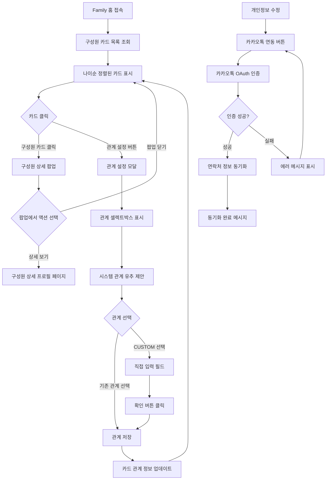

# 기획서: Family 홈 구성원 목록 조회 기능

## 문서 정보
- **프로젝트명**: Family 홈 구성원 목록 조회 기능 (기존 가족트리 시각화 방향 전환)
- **작성일**: 2025-06-05
- **버전**: v1.0
- **작성자**: 기획자 AI

---

## 1. 목표 및 배경 (Why)

### 1.1 프로젝트 목적
기존 복잡한 가족트리 시각화를 실용적인 Family 홈 대시보드로 전환하여, 가족 구성원들이 서로의 기본 정보를 쉽고 빠르게 확인하고 관계를 설정할 수 있는 직관적인 인터페이스를 제공하는 것이 목표

```
- 해결하려는 문제: 기존 복잡한 3세대 트리 구조로 인한 사용성 저하 및 모바일 환경 부적합
- 기대 효과 (정성적):
  * 가족 구성원 정보 접근성 대폭 향상 (복잡한 트리 → 심플한 카드)
  * 모바일 환경에서 직관적이고 사용하기 쉬운 인터페이스 제공
  * 나와의 관계 설정 기능으로 개인화된 가족 관계 관리 가능
  * 지능적 관계 유추 시스템으로 관계 설정 부담 감소
  * 카카오톡 연동을 통한 실시간 연락처 정보 동기화
```

### 1.2 배경 및 현황
```
- 현재 상황:
  * 가족트리 시각화 기능이 기획되어 있으나 복잡한 3세대 트리 구조로 설계됨
  * 모바일 환경에서 트리 구조 조작의 어려움 예상
  * 실제 사용 시나리오(명절, 가족모임)에서 빠른 정보 확인이 더 중요

- 발견된 문제:
  * 복잡한 트리 구조는 정보 확인보다 조작에 더 많은 시간 소요
  * 가족 관계 설정의 복잡성으로 인한 사용자 이탈 우려
  * 연락처 정보 수동 입력의 번거로움 및 최신화 어려움

- 개선 필요성:
  * 실용성과 사용성을 우선한 심플한 인터페이스 필요
  * 스마트한 관계 설정 도구로 사용자 부담 감소
  * 외부 서비스(카카오톡) 연동을 통한 편의성 향상
```

---

## 2. 사용자 흐름 (User Flow)

### 2.1 주요 사용자 여정

#### 시나리오 1: Family 홈에서 구성원 정보 조회
```
1. 사용자가 Family 홈 화면에 접속한다.
2. 화면 중앙에 나이순으로 정렬된 가족 구성원 카드 목록이 표시된다.
3. 각 카드에는 프로필 이미지, 이름, 나와의 관계, 나이, 생년월일이 표시된다.
4. 사용자가 특정 구성원 카드를 클릭한다.
5. 해당 구성원의 상세 정보 팝업이 표시된다.
6. 팝업에서 '상세 보기' 버튼 클릭 시 구성원 상세 프로필 페이지로 이동한다.
```

#### 시나리오 2: 나와의 관계 설정
```
1. 사용자가 구성원 카드에서 '관계 설정' 버튼을 클릭한다.
2. FamilyMemberRelationshipType의 관계 옵션들이 셀렉트박스로 표시된다.
3. 시스템이 기존 관계 정보를 분석하여 유추된 관계를 상단에 제안한다.
   - 예: "A님과 아버지 관계이고, A님이 B님과 형제 관계라면, B님은 나의 삼촌이 아닌가요?"
4. 사용자가 제안된 관계를 선택하거나 직접 다른 관계를 선택한다.
5. 'CUSTOM' 선택 시 직접 입력 가능한 텍스트 필드와 '확인' 버튼이 나타난다.
6. 관계 설정 완료 후 카드의 관계 정보가 즉시 업데이트된다.
```

#### 시나리오 3: 카카오톡 연락처 동기화
```
1. 사용자가 개인정보 수정 페이지에 접속한다.
2. '카카오톡 연락처 동기화' 버튼을 클릭한다.
3. 카카오톡 OAuth 인증 창이 팝업으로 표시된다.
4. 사용자가 카카오톡에서 연락처 정보 제공에 동의한다.
5. 시스템이 카카오톡에서 전화번호 정보를 가져와 프로필에 업데이트한다.
6. '연락처가 성공적으로 동기화되었습니다' 메시지가 표시된다.
```

### 2.2 Mermaid 플로우차트


---

## 3. 기능 명세서

### 3.1 주요 기능 목록
1. **Family 구성원 카드 목록 조회**: 나이순 정렬된 구성원 정보 카드 표시
2. **나와의 관계 설정 기능**: 구성원별 개인화된 관계 정보 설정
3. **지능적 관계 유추 시스템**: 기존 관계 정보 기반 자동 관계 제안
4. **구성원 상세 정보 팝업**: 카드 클릭 시 간단한 상세 정보 표시
5. **카카오톡 연락처 동기화**: OAuth 기반 연락처 정보 자동 업데이트
6. **권한별 정보 표시**: 관리자와 일반 구성원 간 표시 정보 차별화

### 3.2 기능별 상세 정의

#### 기능 1: Family 구성원 카드 목록 조회
```
- Family 홈 접속 시 모든 구성원의 카드가 나이순(어린 순서)으로 표시된다.
- 각 카드에는 프로필 이미지, 이름, 나와의 관계, 나이, 생년월일, 연락처가 포함된다.
- 관계가 설정되지 않은 구성원은 "관계를 설정해주세요" 안내 메시지가 표시된다.
- SUSPENDED 상태의 구성원은 관리자(ADMIN 이상)에게만 표시되며, 일반 구성원에게는 숨김 처리된다.
- 연락처 정보는 카카오톡 동기화 여부에 따라 표시되며, 미동기화 시 "연락처 없음" 표시된다.
```

#### 기능 2: 나와의 관계 설정 기능
```
- 각 구성원 카드에 '관계 설정' 버튼이 제공된다.
- 버튼 클릭 시 FamilyMemberRelationshipType enum의 모든 옵션이 셀렉트박스로 표시된다.
- FATHER, MOTHER, SON, DAUGHTER, GRANDFATHER, GRANDMOTHER, BROTHER, SISTER, UNCLE, AUNT, COUSIN, CUSTOM 등 구체적 관계 제공
- CUSTOM 선택 시 자유 텍스트 입력 필드와 '확인' 버튼이 나타난다.
- 관계 저장 후 해당 카드의 관계 정보가 즉시 업데이트된다.
```

#### 기능 3: 지능적 관계 유추 시스템 (화면단 구현 시 추가)
```
- 새로운 관계 설정 시 기존 관계 네트워크를 분석하여 가능한 관계를 제안한다.
- 예시: A(나)와 B(아버지), B(아버지)와 C(형제) → C는 나의 삼촌 관계 제안
- 관계 셀렉트박스 상단에 "○○님은 나의 △△이 아닌가요?" 형태로 제안 표시
- 제안된 관계 클릭 시 자동으로 해당 관계가 설정된다.
- 복잡한 관계나 유추 불가능한 경우 제안 기능 비활성화
```

#### 기능 4: 구성원 상세 정보 팝업
```
- 구성원 카드 클릭 시 모달 형태의 상세 정보 팝업이 표시된다.
- 팝업에는 기본 정보 외 추가 프로필 정보가 포함된다. (상세 내용은 추후 구성)
- '상세 보기' 버튼 클릭 시 구성원 상세 프로필 페이지로 이동한다. (상세 내용은 추후 구성)
- 관리자(ADMIN 이상)에게는 관리 기능 버튼들이 추가로 표시된다.
- '닫기' 버튼 또는 모달 외부 클릭 시 팝업이 닫힌다.
```

#### 기능 5: 카카오톡 연락처 동기화 (개인정보 수정 시 구현)
```
- 개인정보 수정 페이지에서 '카카오톡 연락처 동기화' 기능을 제공한다.
- 버튼 클릭 시 카카오톡 OAuth 인증 프로세스가 시작된다.
- 사용자의 연락처 정보 제공 동의를 재확인 받는다.
- 인증 성공 시 카카오톡의 전화번호 정보를 사용자 프로필에 업데이트한다.
- 동기화 실패 시 명확한 에러 메시지와 재시도 옵션을 제공한다.
- 동기화된 연락처는 Family 구성원 카드에 즉시 반영된다.
```

---

## 4. 화면 설계 (UI/UX 가이드라인)

### 4.1 텍스트 와이어프레임

#### 4.1.1 Family 홈 메인 화면 (모바일)
```
┌─────────────────────────────────────┐
│ [≡] Family 홈            [⚙️] [👤] │
├─────────────────────────────────────┤
│                                     │
│ 💨Family 구성원 (5명)                │
│                                     │
│ ┌─────────────────────────────────┐ │
│ │ [👤] 김할아버지 (할아버지)       │ │
│ │      89세 • 1935.03.15          │ │
│ │      📞 010-1234-5678           │ │
│ │      [관계 설정]                 │ │
│ └─────────────────────────────────┘ │
│                                     │
│ ┌─────────────────────────────────┐ │
│ │ [👤] 김할머니 (할머니)           │ │
│ │      84세 • 1940.08.22          │ │
│ │      📞 연락처 없음              │ │
│ │      [관계 설정]                 │ │
│ └─────────────────────────────────┘ │
│                                     │
│ ┌─────────────────────────────────┐ │
│ │ [👤] 김아버지 (아버지)           │ │
│ │      55세 • 1969.12.01          │ │
│ │      📞 010-9876-5432           │ │
│ │      [관계 설정]                 │ │
│ └─────────────────────────────────┘ │
│                                     │
│ ┌─────────────────────────────────┐ │
│ │ [👤] 김어머니 (관계를 설정해주세요) │ │
│ │      52세 • 1972.05.18          │ │
│ │      📞 010-5555-1234           │ │
│ │      [관계 설정]                 │ │
│ └─────────────────────────────────┘ │
│                                     │
│ ┌─────────────────────────────────┐ │
│ │ [👤] 김동생 (동생)               │ │
│ │      28세 • 1996.11.30          │ │
│ │      📞 카카오톡 동기화 필요      │ │
│ │      [관계 설정]                 │ │
│ └─────────────────────────────────┘ │
│                                     │
└─────────────────────────────────────┘
```

#### 4.1.2 관계 설정 모달
```
┌─────────────────────────────────────┐
│              관계 설정               │
├─────────────────────────────────────┤
│                                     │
│ 💡 김아버지님은 아버지가 아닌가요?    │
│    [이 관계로 설정하기]              │
│                                     │
│ ────────────────────────────────── │
│                                     │
│ 또는 직접 선택해주세요:              │
│                                     │
│ ┌─────────────────────────────────┐ │
│ │ 아버지            ▼             │ │
│ │ ├ 아버지                        │ │
│ │ ├ 어머니                        │ │
│ │ ├ 할아버지                      │ │
│ │ ├ 할머니                        │ │
│ │ ├ 형                            │ │
│ │ ├ 누나                          │ │
│ │ ├ 동생                          │ │
│ │ ├ 삼촌                          │ │
│ │ ├ 고모                          │ │
│ │ ├ 사촌                          │ │
│ │ └ 직접 입력 (CUSTOM)            │ │
│ └─────────────────────────────────┘ │
│                                     │
│      [취소]        [확인]           │
│                                     │
└─────────────────────────────────────┘
```

#### 4.1.3 CUSTOM 관계 입력 화면
```
┌─────────────────────────────────────┐
│              관계 설정               │
├─────────────────────────────────────┤
│                                     │
│ 직접 관계를 입력해주세요:            │
│                                     │
│ ┌─────────────────────────────────┐ │
│ │ 관계를 입력해주세요...          │ │
│ └─────────────────────────────────┘ │
│                                     │
│ 💡 예시: 의붓아버지, 시아버지,       │
│    큰아버지, 작은아버지 등           │
│                                     │
│      [취소]        [확인]           │
│                                     │
└─────────────────────────────────────┘
```

#### 4.1.4 구성원 상세 팝업
```
┌─────────────────────────────────────┐
│ [×]            구성원 정보            │
├─────────────────────────────────────┤
│                                     │
│         [👤] 김아버지                │
│         아버지                       │
│                                     │
│ 📅 55세 (1969.12.01)               │
│ 📞 010-9876-5432                   │
│ 🏠 서울시 강남구                    │
│ 💼 회사원                           │
│                                     │
│ ────────────────────────────────── │
│                                     │
│ [관계 수정] [연락하기] [상세 보기]   │
│                                     │
│ 👑 관리자 기능 (ADMIN 이상만 표시)   │
│ [권한 변경] [계정 관리]             │
│                                     │
└─────────────────────────────────────┘
```

### 4.2 기본 요구사항
```
- 반응형 디자인: 모바일 우선 설계, 태블릿/데스크톱 대응
- 접근성: 웹 표준 접근성 가이드라인(WCAG) 준수
- 사용성: 터치 친화적 버튼 크기 (최소 44px), 직관적 아이콘 사용
- 브랜드 일관성: 기존 Family Tree 디자인 시스템과 조화
- 성능: 구성원 카드 lazy loading으로 대가족 대응
```

---

## 5. 예외 처리 및 에러 메시지

### 5.1 예외 상황 정의

#### 데이터 조회 관련 예외
```
- Family 구성원이 없는 경우: "아직 Family 구성원이 없습니다. 첫 번째 구성원을 초대해보세요!"
- 네트워크 오류로 구성원 목록 로딩 실패: "구성원 정보를 불러올 수 없습니다. 네트워크 연결을 확인해주세요"
- 서버 응답 지연 시: "구성원 정보를 불러오는 중입니다... 잠시만 기다려주세요"
```

#### 관계 설정 관련 예외
```
- 자신과의 관계 설정 시도: "자기 자신과는 관계를 설정할 수 없습니다"
- 중복 관계 설정 시도: "이미 설정된 관계입니다. 관계를 변경하시겠습니까?"
- CUSTOM 관계 빈 값 입력: "관계를 입력해주세요"
- CUSTOM 관계 특수문자 입력: "한글, 영문, 숫자만 입력 가능합니다"
```

#### 카카오톡 연동 관련 예외
```
- OAuth 인증 실패: "카카오톡 인증에 실패했습니다. 다시 시도해주세요"
- 연락처 정보 없음: "카카오톡에 연락처 정보가 없습니다"
- 네트워크 오류: "카카오톡 연동 중 오류가 발생했습니다. 잠시 후 다시 시도해주세요"
- 사용자 인증 거부: "카카오톡 연락처 정보 제공에 동의해주세요"
```

#### 권한 관련 예외
```
- 비구성원 접근: "Family 구성원만 이용할 수 있는 기능입니다"
- SUSPENDED 계정 접근: "계정이 일시정지 상태입니다. 관리자에게 문의하세요"
- 관리자 기능 접근 시: "관리자 권한이 필요한 기능입니다"
```

### 5.2 에러 메시지 가이드라인
- 친근하고 이해하기 쉬운 언어 사용
- 구체적인 해결 방법 제시
- 가족 서비스에 맞는 따뜻한 톤앤매너 유지
- 기술적 용어 최소화

---

## 6. 기술적 고려사항

### 6.1 FamilyMemberRelationshipType enum 확장
```java
public enum FamilyMemberRelationshipType {
    // 직계 가족
    FATHER("아버지"),
    MOTHER("어머니"), 
    SON("아들"),
    DAUGHTER("딸"),
    
    // 조부모/손자
    GRANDFATHER("할아버지"),
    GRANDMOTHER("할머니"),
    GRANDSON("손자"),
    GRANDDAUGHTER("손녀"),
    
    // 형제자매
    ELDER_BROTHER("형"),
    ELDER_SISTER("누나/언니"),
    YOUNGER_BROTHER("남동생"),
    YOUNGER_SISTER("여동생"),
    
    // 배우자
    HUSBAND("남편"),
    WIFE("아내"),
    
    // 친척
    UNCLE("삼촌/외삼촌"),
    AUNT("고모/이모"),
    NEPHEW("조카"),
    NIECE("조카딸"),
    COUSIN("사촌"),
    
    // 사용자 정의
    CUSTOM("직접 입력");
    
    private final String displayName;
}
```

### 6.2 카카오톡 OAuth 연동 요구사항
```
- Kakao API: OAuth 2.0 기반 인증
- 필요 권한: account_email, phone_number
- 데이터 형식: JSON
- 개인정보 수정 시 재인증 프로세스 구현
- 연락처 정보 업데이트 시 실시간 반영
```

### 6.3 성능 및 확장성 고려사항
```
- API 응답 시간: 구성원 목록 조회 < 500ms
- 이미지 로딩: 프로필 이미지 lazy loading 적용
- 캐싱: 구성원 목록 client-side 캐싱 (5분)
- 대가족 대응: 무한 스크롤 또는 페이징 (구성원 50명 이상 시)
```

### 6.4 기존 구현 현황 및 활용 방안
```
✅ 이미 구현된 기능들:
- family_member_relationship 테이블 존재
- 가족구성원 관계 저장 API 구현 완료
- 전체 가족 구성원 관계 목록 조회 API 구현 완료
- 특정 가족 구성원과의 관계 단건 조회 UseCase 구현 완료

🔄 활용 및 확장 방안:
- 기존 관계 단건 조회 UseCase를 활용하여 구성원별 관계 정보 취득
- 전체 관계 목록 조회 API는 관계 유추 알고리즘에서 활용 가능
- 새로운 Family 홈 전용 API에서 기존 관계 조회 로직 재사용
- FamilyMemberRelationshipType enum만 확장하면 기존 구조 그대로 활용
```

---

## 7. 개발 전달 사항

### 7.1 우선순위
1. **High**: Family 구성원 카드 목록 조회, 나와의 관계 설정 (핵심 MVP)
2. **Medium**: 구성원 상세 팝업, 권한별 정보 표시
3. **Low**: 지능적 관계 유추, 카카오톡 연락처 동기화

### 7.2 개발자 AI에게 전달할 내용
- FamilyMemberRelationshipType enum 확장 및 관계 설정 API 개발
- 나이순 정렬 기능을 포함한 구성원 목록 조회 API 구현
- 권한별 접근 제어 (SUSPENDED 구성원 처리)
- FamilyMemberRelationship 테이블 설계 및 양방향 관계 관리
- 카카오톡 OAuth 연동 API 구현 (개인정보 수정 시)
- 관계 유추 알고리즘 기반 클래스 설계 (화면단 구현 대비)

### 7.3 디자이너 AI에게 전달할 내용
- **텍스트 와이어프레임을 바탕으로 모바일 우선 카드형 레이아웃 디자인**
- **Family Tree 브랜드 가이드라인을 적용한 따뜻하고 친근한 UI 디자인**
- **관계 설정 모달의 직관적인 UX 플로우 및 시각적 피드백 구현**
- **구성원 카드의 정보 계층 구조 최적화 (가독성 우선)**
- **권한별 차별화된 UI 요소 디자인 (관리자 기능 버튼 등)**
- **카카오톡 연동 시 브랜딩 가이드라인 준수**

---

## 부록

### A. 용어 정의
```
- Family 홈: Family 메인 대시보드 화면
- 구성원 카드: 개별 가족 구성원 정보를 담은 UI 컴포넌트  
- 나와의 관계: 현재 로그인한 사용자 기준 다른 구성원과의 관계
- 관계 유추: 기존 관계 네트워크를 분석하여 새로운 관계를 제안하는 지능형 시스템
- SUSPENDED: 일시정지 상태의 Family 구성원 (비공개 처리)
- Custom 관계: 사용자가 직접 입력하는 개인화된 관계명
- 카카오톡 동기화: OAuth를 통한 카카오톡 연락처 정보 자동 업데이트
```

### B. 참고 자료
```
- 기존 구성원 권한 관리 기능: development-docs/ft-002-family-member-role-management/
- 기존 가족트리 시각화 기획: be/planning/family-tree-visualization-planning.md
- Family Tree 디자인 시스템: instructions/workflow/design-guidelines.md
- 카카오톡 API 문서: https://developers.kakao.com/docs/latest/ko/kakaologin/rest-api
- 헥사고날 아키텍처 가이드: be/instructions/architecture-overview.md
```

### C. 변경 이력
```
| 버전 | 날짜 | 변경 내용 | 변경 사유 | 영향도 | 작성자 |
|------|------|-----------|-----------|--------|--------|
| v1.0.0 | 2025-06-05 | 초기 기획서 작성 - 기존 가족트리 시각화 방향 전환 | 복잡한 트리 구조 대신 실용적인 카드형 목록으로 사용성 개선 필요 | 신규 개발 프로젝트 시작, 기존 트리 시각화 기획 대체 | 기획자 AI |
```

---

## 🎯 Epic/Story 구조 정의 (기존 구현 반영)

### Epic: FT-003 Family 홈 구성원 목록 조회 기능

```
Epic-003: Family 홈 구성원 목록 조회 기능 (기존 가족트리 시각화 방향 전환)
├── Story-004: FamilyMemberRelationshipType enum 확장 (기존 구조 활용) 📅 1주차 (백엔드)
├── Story-005: Family 홈 전용 구성원 목록+관계 조회 API 개발 📅 1주차 (백엔드)
├── Story-006: Family 홈 구성원 카드 목록 UI 구현 📅 2주차 (프론트엔드)
├── Story-007: 관계 설정 모달 및 CUSTOM 입력 기능 구현 📅 2주차 (프론트엔드)
├── Story-008: 구성원 상세 정보 팝업 및 권한별 UI 구현 📅 3주차 (프론트엔드)
├── Story-009: 카카오톡 OAuth 연동 및 연락처 동기화 기능 📅 3주차 (백엔드+프론트엔드)
└── Story-010: 지능적 관계 유추 시스템 구현 📅 4주차 (화면단, 선택적 구현)
```

### ✅ 기존 구현 활용 방안
```
Story-004: 기존 family_member_relationship 테이블과 관계 저장 API 그대로 활용
Story-005: 기존 관계 단건 조회 UseCase를 반복 호출하여 구성원별 관계 정보 수집
Story-010: 기존 전체 관계 목록 조회 API를 관계 유추 알고리즘에 활용

⚡ 개발 기간 단축 예상: 기존 4주 → 3주로 단축 가능
```

### Story 완료 조건 (Definition of Done)
```
각 Story별 완료 조건:
✅ 기능 구현 완료 (백엔드 API + 프론트엔드 UI)
✅ 단위 테스트 작성 및 통과 (JUnit5 + Jest)
✅ 인수 테스트 작성 및 통과 (Acceptance Test)
✅ API 문서 작성 (REST Docs)
✅ 코드 리뷰 완료
✅ 기획자 AI 검수 및 승인
✅ 사용자 테스트 시나리오 검증 완료
```

---

## 🚀 다음 단계

### 즉시 진행 가능한 작업
1. **기획서 승인 요청** ← 현재 단계
2. **Story-001 상세 요구사항 작성** (FamilyMemberRelationshipType enum 확장)
3. **개발자 AI에게 Story-001 할당**
4. **단계별 개발 진행 및 검수**

### 개발 우선순위 권장사항
```
Phase 1 (핵심 MVP - 2주차 완료 목표):
- Story-001: 관계 데이터 모델 설계
- Story-002: 구성원 목록 조회 API  
- Story-004: 기본 카드 목록 UI

Phase 2 (관계 설정 기능 - 3주차 완료 목표):
- Story-003: 관계 설정 API
- Story-005: 관계 설정 모달 UI
- Story-006: 상세 팝업 UI

Phase 3 (고급 기능 - 4주차 완료 목표):
- Story-007: 카카오톡 연동
- Story-008: 관계 유추 시스템 (선택적)
```

**🎉 Family 홈 구성원 목록 조회 기능 기획 완료!**

기존 복잡한 가족트리 시각화에서 실용적이고 사용자 친화적인 카드형 목록으로 완전히 방향을 전환한 종합적인 기획서가 완성되었습니다.
