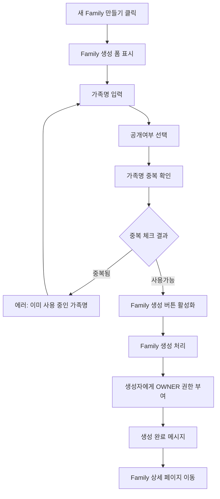
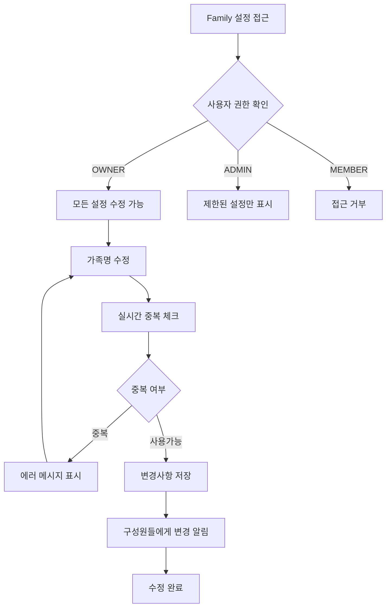
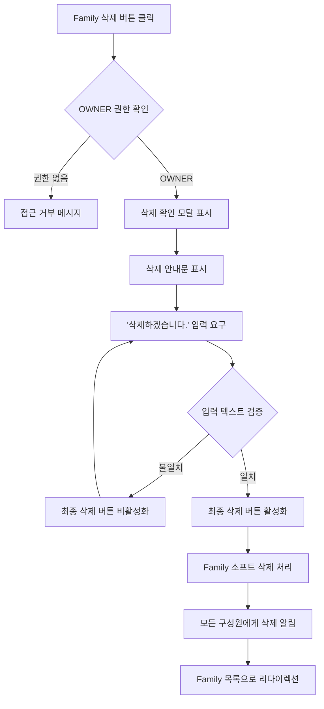

# Family 생성/수정/삭제 기능 기획서

## 문서 정보
- **프로젝트명**: Family Tree - Family 관리 시스템
- **작성일**: 2025-06-09
- **버전**: v1.1
- **작성자**: 기획자 AI

---

## 1. 목표 및 배경 (Why)

### 1.1 프로젝트 목적
```
해결하려는 문제: 
- 사용자들이 가족 단위로 모여서 소통하고 정보를 공유할 수 있는 공간이 필요
- 기존 메신저나 SNS는 가족 전용 기능이 부족하고 프라이버시 관리가 어려움
- 가족 구성원들의 역할과 권한을 체계적으로 관리할 필요성

기대 효과 (정성적):
- 가족 구성원들이 안전하고 편리하게 소통할 수 있는 전용 공간 제공
- 가족별 프라이버시 보호 및 체계적인 권한 관리
- 여러 가족 그룹에 동시 참여 가능하여 확장 가족 관계도 포용
- 카카오톡 오픈채팅방과 유사한 직관적인 사용자 경험 제공
```

### 1.2 배경 및 현황
```
현재 상황:
- JWT 인증 시스템이 완료되어 안전한 사용자 인증 기반 구축 완료
- User 엔티티가 구현되어 기본적인 사용자 관리 시스템 준비됨

발견된 문제:
- 개별 사용자는 존재하지만 가족 단위 그룹핑 기능이 없음
- 가족 구성원 간의 관계 설정 및 권한 관리 체계 미구축

개선 필요성:
- Family Tree 서비스의 핵심인 가족 그룹 기능 구현 필수
- 확장 가능한 권한 체계로 향후 고급 기능 지원 기반 마련
```

---

## 2. 사용자 흐름 (User Flow)

### 2.1 주요 사용자 여정

#### 2.1.1 Family 생성 플로우
```
1. 로그인한 사용자가 '새 Family 만들기' 버튼을 클릭한다.
2. Family 생성 폼이 나타나며 다음 정보를 입력한다:
   - 가족명 (20자 제한, 영어/한국어/숫자/이모지 가능, 공백 불가)
   - 공개 여부 (공개/비공개 선택)
3. '가족명 중복 확인' 버튼을 클릭하여 전체 시스템에서 중복 여부를 확인한다.
4. 중복된 가족명이면 '이미 사용 중인 가족명입니다' 메시지가 뜬다.
5. 모든 조건을 만족하면 'Family 생성' 버튼을 클릭한다.
6. Family가 생성되고 생성자는 자동으로 OWNER 권한을 받는다.
7. 'Family가 생성되었습니다' 메시지와 함께 Family 상세 페이지로 이동한다.
```

#### 2.1.2 Family 수정 플로우
```
1. OWNER 또는 ADMIN 권한 사용자가 Family 설정 페이지에 접근한다.
2. 권한에 따라 수정 가능한 항목이 다르게 표시된다:
   - OWNER: 가족명, 공개여부 모두 수정 가능
   - ADMIN: 현재는 수정 권한 없음 (향후 확장 가능)
3. 가족명 변경 시 실시간으로 중복 체크가 이루어진다.
4. '변경사항 저장' 버튼을 클릭한다.
5. 변경 내용이 저장되고 Family 구성원들에게 변경 알림이 전송된다.
```

#### 2.1.3 Family 삭제 플로우
```
1. OWNER 권한 사용자만 Family 설정의 '위험한 설정' 영역에서 삭제 옵션을 볼 수 있다.
2. 'Family 삭제' 버튼을 클릭한다.
3. 삭제 확인 모달이 나타나며 다음 안내가 표시된다:
   - "Family를 삭제하면 모든 구성원이 자동 탈퇴됩니다"
   - "관련 데이터는 30일간 보관 후 완전 삭제됩니다"
4. 확인을 위해 '삭제하겠습니다.'를 정확히 입력해야 한다.
5. 입력이 완료되면 '최종 삭제' 버튼이 활성화된다.
6. 삭제가 완료되면 모든 구성원에게 삭제 알림이 전송된다.
7. 사용자는 Family 목록 페이지로 리다이렉션된다.
```

### 2.2 Mermaid 플로우차트

#### 2.2.1 Family 생성 플로우


#### 2.2.2 Family 수정 플로우


#### 2.2.3 Family 삭제 플로우


---

## 3. UseCase 조회 기준 구체화

### 3.1 UseCase 포함 여부 확인
- [x] 이 기획에 데이터 조회(Find) UseCase가 포함되나요?
- [x] 데이터 저장/수정/삭제 UseCase가 포함되나요?

### 3.2 단건 조회 UseCase 구체화

#### UseCase 1: Family 단건 조회 (ID 기준)
**Q1. 조회 기준 필드**: ID (Primary Key)
**Q2. 유니크성 확인**: 예 (단건 조회 가능)
**Q3. 조회 실패 처리**: 예외 발생 (FamilyNotFoundException)
**Q4. 권한 제한**: Family 구성원만 조회 가능 (OWNER, ADMIN, MEMBER)

**결정된 Query 클래스명**: `FindFamilyByIdQuery`
**메서드명**: `find()`

#### UseCase 2: Family 단건 조회 (가족명 기준)
**Q1. 조회 기준 필드**: 가족명 (familyName)
**Q2. 유니크성 확인**: 예 (전체 시스템에서 중복 불가)
**Q3. 조회 실패 처리**: Optional 반환 (중복 체크 용도)
**Q4. 권한 제한**: 공개 Family는 모든 사용자, 비공개 Family는 구성원만

**결정된 Query 클래스명**: `FindFamilyByNameQuery`
**메서드명**: `find()`

### 3.3 복수 조회 UseCase 구체화

#### UseCase 3: 사용자별 소속 Family 목록 조회
**Q1. 필터링 조건**: 특정 사용자가 소속된 Family들 (User ID 기준)
**Q2. 정렬 기준**: 최근 활동일순 (최신순)
**Q3. 권한별 접근 제한**: 본인 소속 Family만 조회 가능
**Q4. 페이징 필요성**: 아니오 (일반적으로 15개 이하 예상)

**결정된 Query 클래스명**: `FindFamiliesByUserIdQuery`
**메서드명**: `findAll()`

#### UseCase 4: 공개 Family 검색 조회
**Q1. 필터링 조건**: 공개 설정된 Family + 가족명 키워드 검색
**Q2. 정렬 기준**: 구성원 수 많은 순
**Q3. 권한별 접근 제한**: 모든 인증된 사용자 조회 가능
**Q4. 페이징 필요성**: 예 (페이지당 20개)

**결정된 Query 클래스명**: `FindPublicFamiliesByKeywordQuery`
**메서드명**: `findAll()`

### 3.4 구체화 결과 요약

| UseCase | 조회 기준 | Query 클래스명 | 실패 처리 | 권한 제한 |
|---------|-----------|----------------|-----------|-----------|
| Family 단건 조회 (ID) | ID | FindFamilyByIdQuery | Exception | 구성원만 |
| Family 단건 조회 (이름) | familyName | FindFamilyByNameQuery | Optional | 공개/구성원 |
| 사용자 소속 Family 목록 | userId | FindFamiliesByUserIdQuery | List | 본인만 |
| 공개 Family 검색 | keyword + public | FindPublicFamiliesByKeywordQuery | Page | 모든 사용자 |

---

## 4. 기능 명세서

### 4.1 주요 기능 목록
1. **Family 생성**: 로그인한 사용자가 새로운 가족 그룹을 생성하는 기능
2. **Family 수정**: OWNER 권한으로 가족 정보를 수정하는 기능
3. **Family 삭제**: OWNER 권한으로 가족을 완전 삭제하는 기능
4. **Family 조회**: 다양한 조건으로 가족 정보를 조회하는 기능
5. **권한 관리**: Family 내 사용자별 권한(OWNER, ADMIN, MEMBER) 관리

### 4.2 기능별 상세 정의

#### 기능 1: Family 생성
```
- 인증된 사용자가 '새 Family 만들기' 버튼을 클릭하면 생성 폼이 표시된다.
- 가족명 입력 시 실시간으로 다음 조건을 검증한다:
  * 20자 이하 제한
  * 영어, 한국어, 숫자, 이모지만 허용
  * 공백 문자 불허용
  * 전체 시스템에서 중복 불가
- 공개여부를 선택할 수 있으며, 비공개 선택 시 초대 전용 모드로 설정된다.
- 모든 조건이 만족되면 Family가 생성되고 생성자는 자동으로 OWNER 권한을 받는다.
- 생성 완료 시 성공 메시지와 함께 해당 Family 상세 페이지로 이동한다.
```

#### 기능 2: Family 수정
```
- OWNER 권한 사용자만 Family 설정 페이지에 접근할 수 있다.
- 수정 가능한 항목:
  * 가족명: 동일한 제약 조건으로 변경 가능
  * 공개여부: 공개 ↔ 비공개 전환 가능
- 가족명 변경 시 실시간 중복 체크가 수행된다.
- 변경사항 저장 시 모든 구성원에게 변경 알림이 전송된다.
- 변경 이력이 시스템에 기록되어 추후 감사 기능에 활용된다.
```

#### 기능 3: Family 삭제
```
- OWNER 권한 사용자만 삭제 기능에 접근할 수 있다.
- 삭제 전 다음 안내사항이 표시된다:
  * "모든 구성원이 자동 탈퇴됩니다"
  * "관련 데이터는 30일간 보관 후 완전 삭제됩니다"
- 확인을 위해 '삭제하겠습니다.'를 정확히 입력해야 한다.
- 삭제 처리는 소프트 딜리트로 수행되며, 30일 후 하드 딜리트된다.
- 모든 구성원에게 삭제 알림이 즉시 전송된다.
- 관련 데이터(가족 관계, 게시물 등)도 동일한 보관 정책이 적용된다.
```

#### 기능 4: Family 조회
```
- ID 기준 단건 조회: 구성원만 접근 가능, 존재하지 않으면 404 예외
- 가족명 기준 조회: 중복 체크 및 검색 용도, Optional 반환
- 사용자별 소속 Family 목록: 본인 소속 Family만 최근 활동순 정렬
- 공개 Family 검색: 키워드 기반 검색, 구성원 수 기준 정렬, 페이징 지원
```

#### 기능 5: 권한 관리
```
- OWNER: Family 생성자, 모든 권한 보유 (수정, 삭제, 구성원 관리)
- ADMIN: 일반 관리 권한 (현재는 조회만, 향후 구성원 관리 등 확장 예정)
- MEMBER: 일반 구성원, 기본적인 Family 정보 조회 및 참여 가능
- 권한 변경은 OWNER만 수행 가능 (향후 구성원 관리 기능에서 구현)
```

---

## 5. 화면 설계 (UI/UX 가이드라인)

### 5.1 텍스트 와이어프레임

#### 5.1.1 Family 생성 화면
```
┌─────────────────────────────────────┐
│  ← 뒤로가기     새 Family 만들기      │
│                                     │
│  👨‍👩‍👧‍👦 가족을 만들어보세요           │
│                                     │
│  가족명 *                           │
│  ┌─────────────────────────────┐   │
│  │ 우리가족                     │   │
│  └─────────────────────────────┘   │
│  • 20자 이하, 영어/한글/숫자/이모지   │
│  • 공백 사용 불가                   │
│  [✓ 사용 가능한 가족명입니다]       │
│                                     │
│  공개 설정 *                        │
│  ○ 공개 (누구나 검색하여 가입 요청)  │
│  ● 비공개 (초대를 통해서만 가입)     │
│                                     │
│       [Family 만들기] 버튼          │
│                                     │
│  💡 Family를 만들면 자동으로 소유자가  │
│     되어 모든 권한을 갖게 됩니다.     │
│                                     │
└─────────────────────────────────────┘
```

#### 5.1.2 Family 수정 화면 (OWNER 전용)
```
┌─────────────────────────────────────┐
│  ← 뒤로가기      Family 설정         │
│                                     │
│  ⚙️ 기본 정보                        │
│                                     │
│  가족명                             │
│  ┌─────────────────────────────┐   │
│  │ 우리가족                     │   │
│  └─────────────────────────────┘   │
│  [실시간 중복 확인 결과 영역]        │
│                                     │
│  공개 설정                          │
│  ○ 공개   ● 비공개                  │
│                                     │
│      [변경사항 저장] 버튼            │
│                                     │
│  ━━━━━━━━━━━━━━━━━━━━━━━━━━━━━━━━━  │
│                                     │
│  ⚠️ 위험한 설정                      │
│                                     │
│      [Family 삭제] 버튼             │
│                                     │
└─────────────────────────────────────┘
```

#### 5.1.3 Family 삭제 확인 모달
```
┌─────────────────────────────────────┐
│              ⚠️ 경고                 │
│                                     │
│    Family를 정말 삭제하시겠습니까?    │
│                                     │
│  • 모든 구성원이 자동 탈퇴됩니다      │
│  • 관련 데이터는 30일간 보관됩니다    │
│  • 이 작업은 되돌릴 수 없습니다       │
│                                     │
│  확인을 위해 다음을 입력해주세요:     │
│  '삭제하겠습니다.'                  │
│                                     │
│  ┌─────────────────────────────┐   │
│  │                             │   │
│  └─────────────────────────────┘   │
│                                     │
│    [취소]        [최종 삭제]        │
│               (입력 완료 시 활성화)   │
│                                     │
└─────────────────────────────────────┘
```

#### 5.1.4 Family 목록 화면
```
┌─────────────────────────────────────┐
│               내 Family               │
│                        [+ 새로 만들기] │
│                                     │
│  🔍 공개 Family 검색                 │
│  ┌─────────────────────────────┐   │
│  │ 가족명 검색...               │   │
│  └─────────────────────────────┘   │
│                                     │
│  📋 내가 속한 Family                │
│                                     │
│  ┌─────────────────────────────┐   │
│  │ 👑 우리가족 (OWNER)          │   │
│  │ 구성원 5명 • 최근 활동 2시간 전 │   │
│  └─────────────────────────────┘   │
│                                     │
│  ┌─────────────────────────────┐   │
│  │ 👤 김씨 대가족 (MEMBER)       │   │
│  │ 구성원 12명 • 최근 활동 1일 전  │   │
│  └─────────────────────────────┘   │
│                                     │
│  📢 공개 Family (인기순)             │
│                                     │
│  ┌─────────────────────────────┐   │
│  │ 🌟 행복한 우리집              │   │
│  │ 구성원 8명 • 공개              │   │
│  │           [가입 신청] 버튼     │   │
│  └─────────────────────────────┘   │
│                                     │
└─────────────────────────────────────┘
```

### 5.2 기본 요구사항
```
- 반응형 디자인: 모바일/태블릿/데스크톱 모든 디바이스 대응
- 접근성: 웹 표준 접근성 가이드라인(WCAG) 준수
- 사용성: 카카오톡 오픈채팅방과 유사한 직관적 인터페이스
- 브랜드 일관성: Family Tree 서비스 디자인 시스템 적용
- 실시간 피드백: 입력 검증 결과 즉시 표시
- 안전 장치: 중요한 작업(삭제)에 대한 명확한 확인 과정
```

---

## 6. 예외 처리 및 에러 메시지

### 6.1 예외 상황 정의

#### 6.1.1 Family 생성 관련
```
- 가족명 중복 시: '이미 사용 중인 가족명입니다. 다른 이름을 사용해주세요' 메시지 표시
- 가족명 길이 초과 시: '가족명은 20자 이하로 입력해주세요 (현재 {입력길이}자)' 메시지 표시
- 가족명 특수문자 포함 시: '가족명에는 영어, 한글, 숫자, 이모지만 사용 가능합니다' 메시지 표시
- 가족명 공백 포함 시: '가족명에는 공백을 사용할 수 없습니다' 메시지 표시
- 서버 오류 시: '일시적인 오류가 발생했습니다. 잠시 후 다시 시도해주세요' 메시지 표시
```

#### 6.1.2 Family 수정 관련
```
- 권한 없음 시: '이 작업을 수행할 권한이 없습니다. OWNER만 Family 정보를 수정할 수 있습니다' 메시지 표시
- 존재하지 않는 Family 수정 시: '존재하지 않는 Family입니다' 메시지 표시 후 목록으로 리다이렉션
- 수정 중 가족명 중복 시: 생성과 동일한 중복 에러 메시지
- 동시 수정 충돌 시: '다른 사용자가 동시에 수정하고 있습니다. 페이지를 새로고침 후 다시 시도해주세요' 메시지 표시
```

#### 6.1.3 Family 삭제 관련
```
- 권한 없음 시: '이 작업을 수행할 권한이 없습니다. OWNER만 Family를 삭제할 수 있습니다' 메시지 표시
- 확인 문구 불일치 시: '삭제 확인을 위해 정확히 "삭제하겠습니다."를 입력해주세요' 메시지 표시
- 이미 삭제된 Family 시: '이미 삭제된 Family입니다' 메시지 표시 후 목록으로 리다이렉션
- 삭제 실패 시: '삭제 처리 중 오류가 발생했습니다. 잠시 후 다시 시도해주세요' 메시지 표시
```

#### 6.1.4 Family 조회 관련
```
- 권한 없는 Family 접근 시: '이 Family에 접근할 권한이 없습니다' 메시지 표시 후 목록으로 리다이렉션
- 존재하지 않는 Family 시: '존재하지 않는 Family입니다' 메시지 표시 (404 페이지)
- 검색 결과 없음 시: '검색 결과가 없습니다. 다른 키워드로 시도해보세요' 메시지 표시
- 네트워크 오류 시: '연결에 문제가 발생했습니다. 인터넷 연결을 확인해주세요' 메시지 표시
```

### 6.2 에러 메시지 가이드라인
- 사용자 친화적인 언어 사용 (기술적 용어 지양)
- 구체적인 해결 방법 제시
- 일관된 톤앤매너 유지 (정중하고 도움이 되는 톤)
- 에러의 심각도에 따른 시각적 구분 (색상, 아이콘 활용)

---

## 7. 기술적 고려사항

### 7.1 데이터베이스 설계 요구사항
```
Family 엔티티 필드:
- id (Long): Primary Key
- familyName (String): 가족명, 유니크 제약
- isPublic (Boolean): 공개 여부
- maxMembers (Integer): 최대 구성원 수 (기본값 15)
- createdAt (LocalDateTime): 생성일시
- updatedAt (LocalDateTime): 수정일시
- deletedAt (LocalDateTime): 삭제일시 (소프트 딜리트)

FamilyMember 연관 엔티티:
- id (Long): Primary Key
- familyId (Long): Family 외래키
- userId (Long): User 외래키
- role (Enum): OWNER, ADMIN, MEMBER
- nickname (String): Family 내 별칭 (선택사항)
- joinedAt (LocalDateTime): 가입일시
```

### 7.2 성능 요구사항
```
- 가족명 중복 체크: 실시간 검증, 200ms 이내 응답
- Family 목록 조회: 사용자별 소속 Family 50ms 이내 응답
- 공개 Family 검색: 키워드 검색 500ms 이내 응답, 페이징 적용
- Family 생성: 1초 이내 완료
- Family 삭제: 소프트 딜리트 처리로 즉시 완료, 하드 딜리트는 배치 처리
```

### 7.3 보안 요구사항
```
- JWT 토큰 기반 인증: 기존 구축된 JWT 시스템 활용
- 권한 기반 접근 제어: Family별 사용자 권한 검증
- SQL 인젝션 방지: JPA Parameter Binding 사용
- XSS 방지: 사용자 입력 데이터 이스케이프 처리
- CSRF 방지: Spring Security CSRF 토큰 활용
```

### 7.4 확장성 고려사항
```
- 다국어 지원: 가족명 다국어 입력 지원 준비
- 알림 시스템: Family 변경사항 실시간 알림 연동 준비
- 감사 로그: Family 변경 이력 추적 시스템 연동
- 캐싱: 자주 조회되는 Family 정보 Redis 캐싱 적용
- 이벤트 기반 아키텍처: Family 생성/수정/삭제 이벤트 발행
```

---

## 8. 개발 전달 사항

### 8.1 우선순위
1. **High (MVP 필수)**: Family CRUD 기본 기능
   - Family 생성 (권한: 모든 인증 사용자)
   - Family 조회 (ID 기준, 권한별 접근 제어)
   - Family 수정 (권한: OWNER만)
   - Family 삭제 (권한: OWNER만, 소프트 딜리트)

2. **Medium (기본 기능)**: Family 검색 및 목록
   - 사용자별 소속 Family 목록 조회
   - 가족명 중복 체크 기능
   - 공개 Family 검색 (키워드 기반)

3. **Low (향후 확장)**: 고급 기능
   - Family 통계 정보 (구성원 수, 활동 지표)
   - Family 이미지/아이콘 설정
   - Family 태그 시스템

### 8.2 개발자 AI에게 전달할 내용

#### ✅ **기존 구현 재사용 전략 (최우선)**

**재사용 가능한 기존 Port들:**
```java
// ✅ 이미 구현된 Port들 - 그대로 재사용!
- SaveFamilyPort (FamilyAdapter에서 이미 구현됨)
- ModifyFamilyPort (FamilyAdapter에서 이미 구현됨)  
- FindFamilyPort (FamilyAdapter에서 이미 구현됨)
- SaveFamilyMemberPort (이미 구현됨)
- FindFamilyMemberPort (이미 구현됨)
```

**재사용 가능한 기존 UseCase들:**
```java
// ✅ 이미 구현된 UseCase들 - 조합하여 활용!
- FindFamilyUseCase (기본 Family 조회 기능)
- FindFamilyMemberUseCase (구성원 조회 기능)
```

#### 🎯 **서비스 의존성 주입 전략**
```java
// ✅ 권장: Service가 Port를 직접 주입받기
@Service  
public class CreateFamilyService implements CreateFamilyUseCase {
    // UseCase 주입 대신 Port 직접 주입
    private final SaveFamilyPort saveFamilyPort;           // ✅ 재사용
    private final SaveFamilyMemberPort saveFamilyMemberPort; // ✅ 재사용  
    private final FindFamilyPort findFamilyPort;           // ✅ 재사용
}

// ❌ 지양: UseCase 간 의존성
@Service
public class CreateFamilyService implements CreateFamilyUseCase {
    private final FindFamilyUseCase findFamilyUseCase; // ❌ UseCase 의존성
}
```

#### 도메인 모델링 요구사항 (기존 활용)
```
✅ 기존 Family 도메인 엔티티 활용:
- Family.java: 기본 구조 재사용, familyName 유니크 제약 추가
- FamilyMember.java: 기존 구조 + 역할 관리 (OWNER, ADMIN, MEMBER)
- FamilyMemberRole.java: 기존 열거형 그대로 활용

🆕 신규 추가 필요:
- Family 도메인에 isPublic 필드 추가 (공개/비공개 설정)
- Family 도메인에 소프트 딜리트 지원 (deletedAt 필드)
- 가족명 유니크 제약 검증 로직
```

#### API 설계 요구사항
```
REST API 엔드포인트:
- POST /api/families (Family 생성) 
- GET /api/families/{id} (Family 단건 조회) ✅ 기존 FindFamilyPort 활용
- PUT /api/families/{id} (Family 수정) ✅ 기존 ModifyFamilyPort 활용  
- DELETE /api/families/{id} (Family 삭제) ✅ 기존 ModifyFamilyPort 활용 (소프트 딜리트)
- GET /api/families/my (내 소속 Family 목록) ✅ 기존 FindFamilyMemberPort 활용
- GET /api/families/public?keyword={keyword}&page={page} ✅ 기존 FindFamilyPort.findByNameContaining 활용
- GET /api/families/check-name?name={name} ✅ 기존 FindFamilyPort 활용
```

#### 헥사고날 아키텍처 구조 (기존 패턴 준수)
```
애플리케이션 계층 (신규 구현):
- CreateFamilyUseCase: Family 생성 + OWNER 권한 부여 (SaveFamilyPort + SaveFamilyMemberPort 조합)
- ModifyFamilyUseCase: Family 정보 수정 (기존 ModifyFamilyPort 활용)
- DeleteFamilyUseCase: Family 소프트 딜리트 (기존 ModifyFamilyPort 활용)
- 복수 조회 UseCase: 기존 FindFamilyUseCase 확장

인프라 계층 (기존 활용):
- FamilyAdapter: 기존 구현 그대로 활용, 필요시 메서드만 추가
- FamilyJpaRepository: 기존 구현 확장 (가족명 유니크 제약 등)
```

#### 테스트 요구사항 (기존 패턴 준수)
```
단위 테스트:
- Family 도메인 로직 테스트 (기존 Family 도메인 테스트 패턴 준수)
- 신규 UseCase별 비즈니스 로직 테스트 (기존 AnnouncementService 테스트 패턴 참조)
- 권한 검증 로직 테스트 (기존 ModifyFamilyMemberRoleService 패턴 활용)

통합 테스트:
- Family CRUD API 테스트 (기존 FamilyAdapter 테스트 패턴 준수)
- 권한별 접근 제어 테스트 (기존 JWT 인증 테스트 패턴 활용)
- 동시성 처리 테스트 (기존 테스트 패턴 참조)

인수 테스트:
- 사용자 플로우 기반 시나리오 테스트 (기존 TokenController 테스트 패턴 참조)
- 예외 상황 처리 테스트 (기존 예외 처리 패턴 활용)
```

#### 🔄 **코드 재사용 체크리스트**
```
구현 전 필수 확인 사항:
□ FamilyAdapter의 기존 메서드 재사용 가능 여부 확인
□ Family/FamilyMember 도메인 모델 확장 필요 여부 파악  
□ 기존 FindFamilyPort 메서드로 요구사항 충족 가능한지 검토
□ 기존 SaveFamilyPort/ModifyFamilyPort 활용 방안 검토
□ 기존 테스트 패턴 및 TestContainers 설정 재사용
□ 기존 JWT 인증 로직과의 연동 방안 확인

재사용 우선순위:
1순위: 기존 Port 인터페이스 그대로 활용
2순위: 기존 도메인 모델 확장하여 활용  
3순위: 기존 테스트 패턴 및 설정 재사용
4순위: 기존 예외 처리 및 응답 형식 준수
```

### 8.3 디자이너 AI에게 전달할 내용

#### UI/UX 디자인 요구사항
```
- 제공된 텍스트 와이어프레임을 기반으로 고해상도 비주얼 디자인 완성
- 카카오톡 오픈채팅방과 유사한 직관적인 사용자 경험 제공
- Family Tree 브랜드 가이드라인 및 컬러 시스템 적용
- 모바일 우선 반응형 디자인 (Mobile First)
```

#### 주요 디자인 포인트
```
1. Family 생성 화면:
   - 따뜻하고 친근한 분위기 연출
   - 실시간 입력 검증 피드백의 시각적 구분
   - 명확한 진행 단계 표시

2. Family 설정 화면:
   - 일반 설정과 위험한 설정의 명확한 시각적 구분
   - OWNER 권한의 특별함을 나타내는 UI 요소

3. 삭제 확인 모달:
   - 경고성 메시지의 강조 표현
   - 단계별 확인 과정의 명확한 가이드

4. Family 목록 화면:
   - 내 Family와 공개 Family의 시각적 구분
   - 권한별 배지/아이콘 디자인
   - 카드 형태의 깔끔한 레이아웃
```

---

## 부록

### A. 용어 정의
```
- Family: 가족 그룹 단위, 여러 사용자가 소속될 수 있는 커뮤니티
- OWNER: Family 생성자, 모든 권한을 가진 최고 관리자
- ADMIN: Family 관리자, 일부 관리 권한 보유 (향후 확장)
- MEMBER: 일반 구성원, 기본적인 참여 권한
- 소프트 딜리트: 실제 데이터 삭제가 아닌 삭제 표시 후 일정 기간 보관
- 별칭: Family 내에서 사용하는 개인화된 표시명 (본명과 별개)
```

### B. 참고 자료
```
- JWT 인증 시스템 기획서: be/planning/oauth2-jwt-authentication-system-planning.md
- 헥사고날 아키텍처 가이드: be/instructions/architecture-overview.md
- 도메인 모델링 가이드: be/instructions/entity-mapping.md
- API 설계 표준: be/instructions/api-design-standards.md
```

### C. 변경 이력

| 버전 | 날짜 | 변경 내용 | 변경 사유 | 영향도 | 작성자 |
|------|------|-----------|-----------|--------|--------|
| v1.0.0 | 2025-06-09 | Family 생성/수정/삭제 기능 초기 기획서 작성 | 신규 프로젝트 시작 - Family Tree 핵심 기능 구현 | - | 기획자 AI |
| v1.1.0 | 2025-06-09 | 기존 코드 재사용 전략 반영 및 개발 가이드라인 수정 | 프로젝트 지식 기반 기존 구현 분석 결과 - SaveFamilyPort, FindFamilyPort 등 재사용 가능 확인 | 개발: 구현 공수 50% 이상 절약, 기존 패턴 준수로 일관성 향상, 테스트: 기존 테스트 패턴 재사용 | 기획자 AI |

---

## 🎯 Epic/Story 구조 정의

### Epic: [FT-013] Family 관리 시스템 (Family Management System)

```
Epic-013: Family 관리 시스템 (Family Management System)
├── Story-014: Family 생성 기능 📅 2주차 완료 목표 (백엔드)
├── Story-015: Family 조회 기능 📅 2주차 완료 목표 (백엔드)  
├── Story-016: Family 수정 기능 📅 3주차 완료 목표 (백엔드)
├── Story-017: Family 삭제 기능 📅 3주차 완료 목표 (백엔드)
└── Story-018: Family 검색 기능 📅 4주차 완료 목표 (백엔드)
```

### Story 완료 조건 (Definition of Done)
```
각 Story별 완료 조건:
✅ 헥사고날 아키텍처 기반 백엔드 구현 완료
✅ UseCase, Service, Port/Adapter 패턴 구현
✅ JPA 엔티티 및 Repository 구현
✅ 단위 테스트 작성 및 통과 (JUnit5 + AssertJ)
✅ 통합 테스트 작성 및 통과 (TestContainers)
✅ 인수 테스트 작성 및 통과 (REST API 테스트)
✅ API 문서 작성 (REST Docs)
✅ 권한 기반 접근 제어 구현 및 테스트
✅ 예외 처리 및 에러 응답 구현
✅ 기획자 AI 검수 및 승인
✅ 개발 문서 작성 완료
```

---

## 🚀 다음 단계

### 즉시 진행 가능한 작업
1. **기획서 승인 요청** ← 현재 단계  
2. **Story-014 (Family 생성) 상세 요구사항 작성**
3. **개발자 AI에게 Story-014 할당**
4. **1단계 코어 계층부터 단계별 개발 진행**

### 개발 우선순위 권장사항
```
Phase 1 (핵심 MVP - 2주차 완료 목표):
- Story-014: Family 생성 기능 (CREATE)
- Story-015: Family 조회 기능 (READ)

Phase 2 (기본 관리 기능 - 3주차 완료 목표):
- Story-016: Family 수정 기능 (UPDATE)
- Story-017: Family 삭제 기능 (DELETE)

Phase 3 (확장 기능 - 4주차 완료 목표):
- Story-018: Family 검색 기능 (공개 Family 검색, 키워드 기반)
```

**🎉 Family 관리 시스템 기획 완료!**

로그인한 사용자가 안전하고 체계적으로 가족 그룹을 생성, 관리, 운영할 수 있는 핵심 기능을 제공하는 시스템입니다.