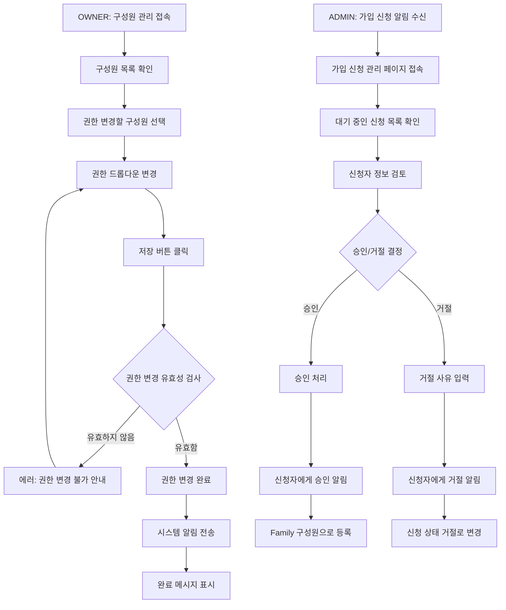

# 기획서: Family 구성원 권한 관리 기능

## 문서 정보
- **프로젝트명**: Family 구성원 권한 관리 시스템
- **작성일**: 2025-06-02
- **버전**: v1.0
- **작성자**: 기획자 AI

---

## 1. 목표 및 배경 (Why)

### 1.1 프로젝트 목적
Family 내에서 계층적 권한 구조를 확립하여 운영 효율성을 높이고, Family 생성자에게 집중된 관리 업무를 분산시켜 지속가능한 커뮤니티 운영 체계를 구축하는 것이 목표

```
- 해결하려는 문제: Family 생성자 혼자 모든 관리 업무를 처리해야 하는 구조적 한계
- 기대 효과 (정성적):
  * Family 생성자의 관리 부담 대폭 감소
  * 신뢰받는 구성원에게 책임감 부여로 커뮤니티 결속력 강화
  * 단계별 권한 시스템으로 질서있는 Family 운영 체계 구축
  * 가입 신청 처리 속도 개선으로 신규 구성원 경험 향상
  * 적절한 권한 분산으로 Family 규모 확장 시에도 안정적 운영 가능
```

### 1.2 배경 및 현황
```
- 현재 상황:
  * Family 생성자(OWNER)만 모든 관리 기능 수행 가능
  * 가입 신청, 구성원 관리, 공지사항 작성 등 모든 업무가 한 사람에게 집중
  * 대규모 Family에서 관리자 부재 시 운영 정체

- 발견된 문제:
  * Family 생성자 부재 시 가입 신청 승인이 지연되어 신규 구성원 이탈 발생
  * 단일 관리자 구조로 인한 Family 운영의 지속가능성 문제
  * 구성원들의 참여 의욕 저하 (권한 없이 수동적 참여만 가능)

- 개선 필요성:
  * 관리 권한을 신뢰할 수 있는 구성원에게 위임할 수 있는 시스템 필요
  * Family 규모가 커져도 원활하게 운영될 수 있는 확장 가능한 구조 필요
  * 구성원들의 적극적 참여를 유도할 수 있는 역할 체계 필요
```

---

## 2. 사용자 흐름 (User Flow)

### 2.1 주요 사용자 여정

#### 시나리오 1: Family 생성자가 구성원에게 관리자 권한 부여
```
1. Family 생성자가 Family 관리 페이지에 접속한다.
2. '구성원 관리' 탭을 클릭한다.
3. 구성원 목록에서 권한을 부여하고 싶은 구성원을 찾는다.
4. 해당 구성원의 권한 드롭다운을 'MEMBER'에서 'ADMIN'으로 변경한다.
5. '저장' 버튼을 클릭한다.
6. "김철수님에게 관리자 권한이 부여되었습니다" 확인 메시지가 표시된다.
7. 시스템이 해당 구성원에게 권한 변경 알림을 전송한다.
```

#### 시나리오 2: Family 관리자가 가입 신청 처리
```
1. Family 관리자가 새로운 가입 신청 알림을 받는다.
2. Family 관리 페이지의 '가입 신청' 탭에 접속한다.
3. 대기 중인 가입 신청 목록을 확인한다.
4. 각 신청자의 프로필과 신청 메시지를 검토한다.
5. 승인할 경우 '승인' 버튼, 거절할 경우 '거절' 버튼을 클릭한다.
6. 거절 시에는 선택적으로 거절 사유를 입력할 수 있다.
7. 결정이 완료되면 신청자에게 결과 알림이 전송된다.
```

### 2.2 Mermaid 플로우차트


---

## 3. 기능 명세서

### 3.1 주요 기능 목록
1. **구성원 권한 관리 기능**: OWNER가 구성원의 역할을 MEMBER ↔ ADMIN으로 변경
2. **가입 신청 처리 기능**: ADMIN 이상 권한자가 대기 중인 가입 신청을 승인/거절
3. **구성원 역할 조회 기능**: Family 내 모든 구성원의 권한과 상태 확인
4. **권한 기반 접근 제어**: 각 기능별로 최소 권한 요구사항 검증

### 3.2 기능별 상세 정의

#### 기능 1: 구성원 권한 관리
```
- OWNER가 구성원 관리 페이지에서 특정 구성원의 권한을 변경할 수 있다.
- 권한은 MEMBER(일반 구성원)와 ADMIN(관리자) 간에만 변경 가능하다.
- OWNER 권한은 변경할 수 없으며, 자신의 권한도 변경할 수 없다.
- 권한 변경 시 해당 구성원에게 알림이 전송된다.
- 모든 권한 변경 내역은 시스템에 기록된다.
```

#### 기능 2: 가입 신청 처리
```
- ADMIN 이상 권한을 가진 구성원이 대기 중인 가입 신청을 처리할 수 있다.
- 각 가입 신청에 대해 승인 또는 거절 결정을 할 수 있다.
- 거절 시 선택적으로 거절 사유를 입력할 수 있다.
- 승인된 신청자는 자동으로 MEMBER 권한의 Family 구성원이 된다.
- 처리 결과는 신청자에게 즉시 알림으로 전송된다.
```

#### 기능 3: 구성원 역할 조회
```
- Family 구성원이라면 누구나 Family 내 구성원 목록과 각자의 역할을 조회할 수 있다.
- 구성원 목록에는 이름, 역할(OWNER/ADMIN/MEMBER), 상태(ACTIVE/SUSPENDED) 정보가 표시된다.
- 권한에 따라 추가로 볼 수 있는 정보가 다르다 (ADMIN 이상만 구성원 상세 정보 접근 가능).
```

---

## 4. 화면 설계 (UI/UX 가이드라인)

### 4.1 텍스트 와이어프레임

#### 4.1.1 구성원 관리 화면 (OWNER 전용)
```
┌─────────────────────────────────────────────────────────────┐
│ [← 뒤로] Family 관리 > 구성원 관리              [설정 ⚙️] │
│                                                           │
│ 구성원 관리                                                │
│ Family 구성원들의 권한을 관리할 수 있습니다.                │
│                                                           │
│ ┌─────────────────────────────────────────────────────┐   │
│ │ 🔍 구성원 검색                                     │   │
│ └─────────────────────────────────────────────────────┘   │
│                                                           │
│ ┌─────────────────────────────────────────────────────┐   │
│ │ 김철수        OWNER      ACTIVE        [변경 불가]  │   │
│ │ 이영희        ADMIN      ACTIVE        [MEMBER ▼]   │   │
│ │ 박민수        MEMBER     ACTIVE        [ADMIN  ▼]   │   │
│ │ 최지영        MEMBER     ACTIVE        [ADMIN  ▼]   │   │
│ └─────────────────────────────────────────────────────┘   │
│                                                           │
│                                    [변경 취소] [저장하기] │
│                                                           │
└─────────────────────────────────────────────────────────────┘
```

#### 4.1.2 가입 신청 관리 화면 (ADMIN 이상)
```
┌─────────────────────────────────────────────────────────────┐
│ [← 뒤로] Family 관리 > 가입 신청 관리           [설정 ⚙️] │
│                                                           │
│ 가입 신청 관리                                 🔔 3건 대기 │
│ 새로운 가입 신청을 검토하고 승인/거절을 결정하세요.         │
│                                                           │
│ ┌─────────────────────────────────────────────────────┐   │
│ │ 📋 대기 중 (3) │ ✅ 승인됨 (15) │ ❌ 거절됨 (2) │   │
│ └─────────────────────────────────────────────────────┘   │
│                                                           │
│ ┌─────────────────────────────────────────────────────┐   │
│ │ [👤] 홍길동                        신청일: 2024-12-01  │
│ │      "안녕하세요. 가족 모임에 참여하고 싶습니다."      │
│ │                                [거절] [승인]         │
│ │ ─────────────────────────────────────────────────── │
│ │ [👤] 김영수                        신청일: 2024-12-01  │
│ │      "친구 소개로 알게 되었습니다."                   │
│ │                                [거절] [승인]         │
│ └─────────────────────────────────────────────────────┘   │
│                                                           │
└─────────────────────────────────────────────────────────────┘
```

### 4.2 기본 요구사항
```
- 반응형 디자인: 모바일/태블릿/데스크톱 모든 디바이스 대응
- 접근성: 웹 표준 접근성 가이드라인(WCAG) 준수
- 사용성: 직관적이고 사용하기 쉬운 인터페이스
- 브랜드 일관성: 기존 디자인 시스템과 조화
- 권한별 UI 차별화: 권한에 따라 보이는/숨겨지는 기능 명확히 구분
```

---

## 5. 예외 처리 및 에러 메시지

### 5.1 예외 상황 정의

#### 권한 관련 예외
```
- MEMBER가 관리 기능 접근 시: "이 기능은 관리자 이상만 사용할 수 있습니다"
- 자신의 권한 변경 시도 시: "자신의 권한은 변경할 수 없습니다"
- OWNER 권한 변경 시도 시: "소유자 권한은 변경할 수 없습니다"
- 비활성화된 구성원이 관리 기능 접근 시: "계정이 일시정지 상태입니다. 관리자에게 문의하세요"
```

#### 가입 신청 처리 예외
```
- 이미 처리된 신청 재처리 시: "이미 처리된 가입 신청입니다"
- 존재하지 않는 신청 처리 시: "가입 신청을 찾을 수 없습니다"
- 네트워크 오류 시: "처리 중 오류가 발생했습니다. 잠시 후 다시 시도해주세요"
```

### 5.2 에러 메시지 가이드라인
- 사용자 친화적인 언어 사용
- 해결 방법 제시 (가능한 경우)
- 일관된 톤앤매너 유지
- 보안상 민감한 정보는 노출하지 않음

---

## 6. 기술적 고려사항

### 6.1 권한 검증 체계
```
- 3단계 권한 체계: OWNER > ADMIN > MEMBER
- API 레벨에서의 권한 검증 필수
- 프론트엔드에서도 권한별 UI 제어
- 세션 및 토큰 기반 인증 시스템과 연동
```

### 6.2 데이터 일관성
```
- 권한 변경 시 트랜잭션 처리로 데이터 일관성 보장
- 가입 신청 처리 시 중복 처리 방지 로직
- 구성원 상태와 권한 간의 관계 무결성 유지
```

---

## 7. 개발 전달 사항

### 7.1 우선순위
1. **High**: 구성원 권한 관리, 가입 신청 처리 (핵심 MVP)
2. **Medium**: 구성원 역할 조회, 권한 기반 접근 제어
3. **Low**: 고급 검색, 일괄 처리 기능

### 7.2 개발자 AI에게 전달할 내용
- 위 기능 명세를 바탕으로 3단계 권한 시스템 구현
- FamilyMemberRole 열거형 및 권한 검증 로직 개발
- 가입 신청 상태 관리 시스템 구현
- 트랜잭션 처리 및 데이터 일관성 보장

### 7.3 디자이너 AI에게 전달할 내용
- 텍스트 와이어프레임을 바탕으로 권한별 차별화된 UI 디자인
- 관리자/일반 구성원 구분이 명확한 인터페이스 설계
- 가입 신청 승인/거절 프로세스의 직관적 UX 구현
- 접근성과 사용성을 고려한 반응형 디자인

---

## 부록

### A. 용어 정의
```
- OWNER: Family 생성자, 모든 권한 보유
- ADMIN: 관리자, 가입 신청 처리 및 일부 관리 기능 수행 가능
- MEMBER: 일반 구성원, 기본 조회 권한만 보유
- ACTIVE: 활성 상태의 구성원
- SUSPENDED: 일시정지 상태의 구성원
- PENDING: 가입 신청 대기 상태
- APPROVED: 가입 신청 승인 상태
- REJECTED: 가입 신청 거절 상태
```

### B. 참고 자료
```
- Family 구성원 권한 관리 기능 개발 문서 (완료): development-docs/ft-002-family-member-role-management/
- 기존 Family 가입 기능 명세서
- 사용자 인증 시스템 연동 가이드
```

### C. 변경 이력
```
| 버전 | 날짜 | 변경 내용 | 변경 사유 | 영향도 | 작성자 |
|------|------|-----------|-----------|--------|--------|
| v1.0.0 | 2025-06-02 | 초기 기획서 작성 | Family 구성원 권한 관리 시스템 도입 필요성 | 신규 개발 프로젝트 시작 | 기획자 AI |
```
