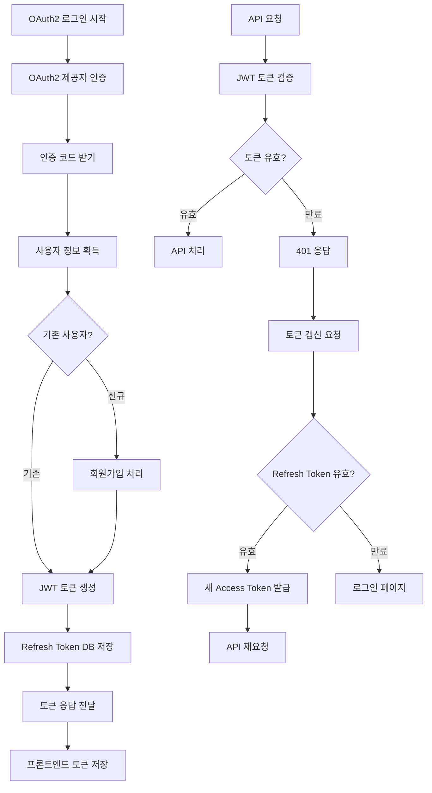

# 기획서: OAuth2 JWT 인증 시스템 구현

## 문서 정보
- **프로젝트명**: OAuth2 JWT 인증 시스템 구현 (세션 기반에서 토큰 기반 전환)
- **작성일**: 2025-06-08
- **버전**: v1.0
- **작성자**: 기획자 AI

---

## 1. 목표 및 배경 (Why)

### 1.1 프로젝트 목적
기존 OAuth2 + 세션 기반 인증을 JWT 토큰 기반 Stateless 인증으로 전환하여, 프론트엔드(React/SPA)를 위한 현대적이고 확장 가능한 인증 시스템을 구축하는 것이 목표

```
- 해결하려는 문제: 
  * 세션 기반 인증의 서버 상태 의존성으로 인한 확장성 제약
  * 프론트엔드 SPA와의 인증 연동 복잡성
  * 마이크로서비스 아키텍처 전환 시 세션 공유 문제

- 기대 효과 (정성적):
  * 서버 확장성 향상 (Stateless 아키텍처)
  * 프론트엔드 개발 생산성 향상 (API 기반 인증)
  * 마이크로서비스 아키텍처 기반 마련
  * 토큰 기반 보안 강화 (만료 시간 세분화)
  * 다양한 클라이언트 지원 (웹, 모바일 앱 등)
```

### 1.2 배경 및 현황
```
- 현재 상황:
  * OAuth2 (Google, Kakao) + 세션 기반 인증 시스템 구현됨
  * Spring Security와 OAuth2UserService 구현 완료
  * FTUser 도메인 객체 및 기본 인증 구조 존재
  * 세션 기반 웹 애플리케이션으로 제한됨

- 발견된 문제:
  * 프론트엔드 SPA 개발 시 CORS 및 세션 관리 복잡성
  * 서버 확장 시 세션 클러스터링 필요
  * API 기반 모바일 앱 개발 어려움
  * 세션 타임아웃 관리의 불편함

- 개선 필요성:
  * 프론트엔드 친화적인 토큰 기반 인증 필요
  * Stateless 아키텍처로 서버 확장성 확보
  * 토큰 만료/갱신 체계를 통한 보안 강화
  * REST API 중심 아키텍처로 전환
```

---

## 2. 사용자 흐름 (User Flow)

### 2.1 주요 사용자 여정

#### 시나리오 1: OAuth2 로그인 후 JWT 토큰 발급
```
1. 사용자가 로그인 페이지에서 '구글 로그인' 또는 '카카오 로그인' 버튼을 클릭한다.
2. OAuth2 제공자(구글/카카오)의 인증 페이지로 리디렉션된다.
3. 사용자가 OAuth2 제공자에서 로그인을 완료한다.
4. OAuth2 제공자가 인증 코드와 함께 콜백 URL로 리디렉션한다.
5. 백엔드에서 인증 코드를 사용해 사용자 정보를 획득한다.
6. 기존 사용자인지 확인하고, 신규 사용자면 회원가입을 진행한다.
7. JWT Access Token(1시간 만료)과 Refresh Token(7일 만료)을 생성한다.
8. Refresh Token을 데이터베이스에 저장한다.
9. 프론트엔드에 토큰 정보를 전달한다 (JSON 응답).
10. 프론트엔드가 Access Token을 저장하고 메인 화면으로 이동한다.
```

#### 시나리오 2: API 요청 시 JWT 토큰 인증
```
1. 프론트엔드가 API 요청 시 Authorization 헤더에 "Bearer {AccessToken}"을 포함한다.
2. JWT 필터가 요청을 가로채서 토큰을 추출한다.
3. 토큰 서명을 검증하고 만료 시간을 확인한다.
4. 토큰이 유효하면 토큰에서 사용자 정보를 추출한다.
5. SecurityContext에 인증 정보를 설정한다.
6. API 요청이 정상적으로 처리된다.
7. 토큰이 유효하지 않으면 401 Unauthorized 응답을 반환한다.
```

### 2.2 Mermaid 플로우차트


---

## 3. UseCase 조회 기준 구체화

### 3.1 UseCase 포함 여부 확인
- [x] 이 기획에 데이터 조회(Find) UseCase가 포함되나요?
- [x] 데이터 저장/수정/삭제 UseCase가 포함되나요?

### 3.2 단건 조회 UseCase 구체화

#### UseCase 1: Refresh Token 조회
**조회 기준**: 사용자 ID (User ID) - 사용자당 하나의 Refresh Token만 저장
**Query 클래스명**: `FindRefreshTokenByUserIdQuery`
**실패 처리**: Optional 반환 (토큰 없음 = 로그아웃 상태)
**권한 제한**: 본인만 조회 가능

#### UseCase 2: 사용자 정보 조회 (토큰 검증 시)  
**조회 기준**: 사용자 ID (User ID) - JWT 토큰에서 추출
**Query 클래스명**: `FindUserByIdQuery`
**실패 처리**: 예외 발생 (토큰이 유효하지만 사용자 없음 = 데이터 불일치)
**권한 제한**: 토큰 인증된 사용자만

### 3.3 복수 조회 UseCase 구체화

#### UseCase 3: 만료된 Refresh Token 정리 (배치 작업용)
**조회 기준**: 만료일 기준 필터링
**Query 클래스명**: `FindExpiredRefreshTokensQuery`
**실패 처리**: 빈 리스트 반환
**권한 제한**: 시스템 관리자만 (배치 작업)

---

## 4. 기능 명세서

### 4.1 주요 기능 목록
1. **JWT 토큰 생성 및 검증**: Access Token과 Refresh Token 생성/검증 시스템
2. **OAuth2 JWT 연동**: 기존 OAuth2 로그인에 JWT 토큰 발급 추가
3. **토큰 기반 API 인증**: JWT 필터를 통한 Stateless 인증
4. **토큰 갱신 시스템**: Refresh Token을 사용한 Access Token 갱신
5. **토큰 저장소 관리**: 데이터베이스 기반 Refresh Token 관리
6. **로그아웃 처리**: 토큰 무효화 및 정리

### 4.2 기능별 상세 정의

#### 기능 1: JWT 토큰 생성 및 검증
```
- JWT 라이브러리(jjwt)를 사용하여 토큰 생성 및 검증 기능 구현
- Access Token: 사용자 ID, 이메일, 권한 정보 포함, 1시간 만료
- Refresh Token: 사용자 ID와 토큰 식별자 포함, 7일 만료
- HS256 알고리즘 사용, 비밀 키는 application.yml에 설정
- 토큰 서명 검증, 만료 시간 검증, 형식 검증 포함
- 토큰 파싱 실패 시 적절한 예외 발생 (InvalidTokenException)
```

#### 기능 2: OAuth2 JWT 연동
```
- 기존 OAuth2UserServiceImpl을 확장하여 JWT 토큰 발급 추가
- OAuth2 인증 성공 시 세션 대신 JWT 토큰 생성
- OAuth2SuccessHandler에서 토큰 생성 후 프론트엔드로 응답
- 토큰 응답 방식: JSON API 응답 (프론트엔드 친화적)
- 기존 FTUser 도메인 객체 재사용
- 신규 사용자 등록 시 자동으로 JWT 토큰 발급
```

#### 기능 3: 토큰 기반 API 인증
```
- JwtAuthenticationFilter 구현하여 모든 API 요청 검증
- Authorization 헤더에서 "Bearer {token}" 형식으로 토큰 추출
- 토큰 검증 후 SecurityContext에 인증 정보 설정
- 인증 실패 시 401 Unauthorized 응답 (JSON 형태)
- @AuthFTUser 어노테이션으로 컨트롤러에서 사용자 정보 주입
- 기존 세션 기반 인증과 JWT 인증 동시 지원 (점진적 전환)
```

---

## 5. 예외 처리 및 에러 메시지

### 5.1 JWT 토큰 관련 예외 상황

#### 토큰 검증 관련 예외
```
- 토큰이 없는 경우: "로그인이 필요합니다" (401 Unauthorized)
- 토큰 형식이 잘못된 경우: "유효하지 않은 인증 정보입니다" (401 Unauthorized)
- 토큰 서명이 잘못된 경우: "인증에 실패했습니다" (401 Unauthorized)
- 토큰이 만료된 경우: "세션이 만료되었습니다. 다시 로그인해주세요" (401 Unauthorized)
- 토큰에 필수 정보 누락: "인증 정보가 올바르지 않습니다" (401 Unauthorized)
```

#### 토큰 갱신 관련 예외
```
- Refresh Token이 없는 경우: "다시 로그인해주세요" (401 Unauthorized)
- Refresh Token이 만료된 경우: "세션이 만료되었습니다. 다시 로그인해주세요" (401 Unauthorized)
- Refresh Token이 DB에 없는 경우: "유효하지 않은 세션입니다. 다시 로그인해주세요" (401 Unauthorized)
- 토큰 갱신 중 서버 오류: "일시적인 오류가 발생했습니다. 잠시 후 다시 시도해주세요" (500 Internal Server Error)
```

### 5.2 에러 응답 형식 표준화
```json
{
  "timestamp": "2025-06-08T10:30:00Z",
  "status": 401,
  "error": "Unauthorized",
  "message": "세션이 만료되었습니다. 다시 로그인해주세요",
  "path": "/api/families/123/members",
  "errorCode": "TOKEN_EXPIRED"
}
```

---

## 6. 기술적 고려사항

### 6.1 JWT 라이브러리 및 설정
```yaml
# application.yml 추가 설정
jwt:
  secret: ${JWT_SECRET:your-256-bit-secret-key-here-make-it-long-enough}
  access-token-expiration: 3600 # 1시간 (초 단위)
  refresh-token-expiration: 604800 # 7일 (초 단위)
  issuer: family-tree-app
```

```gradle
// build.gradle 의존성 추가
implementation 'io.jsonwebtoken:jjwt-api:0.11.5'
implementation 'io.jsonwebtoken:jjwt-impl:0.11.5'
implementation 'io.jsonwebtoken:jjwt-jackson:0.11.5'
```

### 6.2 데이터베이스 스키마 설계
```sql
CREATE TABLE refresh_tokens (
    id BIGINT AUTO_INCREMENT PRIMARY KEY,
    user_id BIGINT NOT NULL,
    token_hash VARCHAR(255) NOT NULL,
    expires_at TIMESTAMP NOT NULL,
    created_at TIMESTAMP DEFAULT CURRENT_TIMESTAMP,
    updated_at TIMESTAMP DEFAULT CURRENT_TIMESTAMP ON UPDATE CURRENT_TIMESTAMP,
    UNIQUE KEY uk_user_id (user_id),
    INDEX idx_expires_at (expires_at),
    FOREIGN KEY fk_user_id (user_id) REFERENCES users(id) ON DELETE CASCADE
);
```

### 6.3 보안 고려사항
```
- JWT Secret Key: 256비트 이상의 강력한 키 사용, 환경변수로 관리
- Refresh Token 저장: 해시 처리하여 DB에 저장 (원본 토큰 노출 방지)
- 토큰 전송: HTTPS 필수, XSS 방지를 위한 HttpOnly 쿠키 고려
- CORS 설정: 프론트엔드 도메인만 허용
- Rate Limiting: 토큰 갱신 API에 요청 제한 적용
- 토큰 갱신 시 기존 토큰 무효화: 토큰 재사용 공격 방지
```

---

## 7. 개발 전달 사항

### 7.1 우선순위
1. **High**: JWT 토큰 생성/검증, OAuth2 JWT 연동 (핵심 MVP)
2. **Medium**: 토큰 갱신 시스템, API 인증 필터
3. **Low**: 토큰 관리 배치 작업, 고급 보안 기능

### 7.2 개발자 AI에게 전달할 내용
- **JWT 토큰 유틸리티 클래스 구현** (생성, 검증, 파싱)
- **RefreshToken 엔티티 및 리포지토리 설계**
- **JwtAuthenticationFilter 구현** (Spring Security 통합)
- **OAuth2 성공 핸들러 수정** (JWT 토큰 발급)
- **토큰 갱신 API 구현** (/api/auth/refresh)
- **로그아웃 API 구현** (/api/auth/logout)
- **JWT 관련 예외 처리 및 에러 응답 표준화**
- **기존 @AuthFTUser 어노테이션과 JWT 인증 연동**
- **헥사고날 아키텍처 원칙 준수** (기존 패턴 유지)

---

## 부록

### A. 용어 정의
```
- JWT (JSON Web Token): JSON 형태의 정보를 안전하게 전송하기 위한 토큰 표준
- Access Token: API 요청 시 사용하는 단기 인증 토큰 (1시간 만료)
- Refresh Token: Access Token 갱신에 사용하는 장기 토큰 (7일 만료)
- Claims: JWT 토큰에 포함된 사용자 정보 (사용자 ID, 이메일 등)
- Bearer 인증: Authorization 헤더에 "Bearer {token}" 형식으로 토큰을 전송하는 방식
- Stateless 인증: 서버가 세션 상태를 저장하지 않는 인증 방식
```

### B. 참고 자료
```
- JWT 공식 사이트: https://jwt.io/
- jjwt 라이브러리 문서: https://github.com/jwtk/jjwt
- Spring Security JWT 가이드: https://docs.spring.io/spring-security/reference/servlet/oauth2/resource-server/jwt.html
- 기존 OAuth2 구현: be/src/main/java/io/jhchoe/familytree/common/config/SecurityConfig.java
- 헥사고날 아키텍처 가이드: be/instructions/architecture-overview.md
```

### C. 변경 이력
```
| 버전 | 날짜 | 변경 내용 | 변경 사유 | 영향도 | 작성자 |
|------|------|-----------|-----------|--------|--------|
| v1.0.0 | 2025-06-08 | 초기 기획서 작성 - OAuth2 JWT 인증 시스템 구현 | 세션 기반에서 토큰 기반으로 전환하여 프론트엔드 SPA 지원 및 확장성 확보 | 신규 개발 프로젝트 시작, 기존 인증 시스템 확장 | 기획자 AI |
```

---

## 🎯 Epic/Story 구조 정의

### Epic: FT-006 OAuth2 JWT 인증 시스템 구현

```
Epic-006: OAuth2 JWT 인증 시스템 구현 (OAuth2 JWT Authentication System)
├── FT-007: JWT 토큰 유틸리티 및 핵심 인프라 구현 📅 (백엔드)
├── FT-008: RefreshToken 엔티티 및 토큰 저장소 구현 📅 (백엔드)
├── FT-009: JWT 인증 필터 및 Spring Security 통합 📅 (백엔드)
├── FT-010: OAuth2 JWT 연동 및 토큰 발급 구현 📅 (백엔드)
├── FT-011: 토큰 갱신 및 로그아웃 API 구현 📅 (백엔드)
└── FT-012: JWT 예외 처리 및 보안 강화 📅 (백엔드)
```

### Story 일정 및 의존성 관리
| Story | 담당 | 예상기간 | 의존성 |
|-------|------|----------|--------|
| FT-007 | 백엔드 | 2일 | 없음 |
| FT-008 | 백엔드 | 2일 | FT-007 |
| FT-009 | 백엔드 | 1일 | FT-008 |
| FT-010 | 백엔드 | 2일 | FT-009 |
| FT-011 | 백엔드 | 1일 | FT-010 |
| FT-012 | 백엔드 | 2일 | FT-011 |

### ✅ 기존 구현 활용 방안
```
FT-007: 기존 FTUser 도메인 객체를 JWT Claims와 매핑하여 재사용
FT-008: 기존 User 엔티티와 연관관계 설정으로 RefreshToken 테이블 설계
FT-009: 기존 @AuthFTUser 어노테이션을 JWT 인증과 호환되도록 확장
FT-010: 기존 OAuth2UserServiceImpl 및 SecurityConfig 구조 활용
FT-011: 기존 API 응답 형식과 일관성 있는 토큰 API 설계
FT-012: 기존 예외 처리 패턴을 JWT 관련 예외에도 적용

⚡ 개발 기간 단축 예상: 기존 OAuth2 인프라 활용으로 총 10일 완료 예정
```

### Story 완료 조건 (Definition of Done)
```
각 Story별 완료 조건:
✅ 기능 구현 완료 (백엔드 API + JWT 인증 시스템)
✅ 단위 테스트 작성 및 통과 (JUnit5 + Mockito)
✅ 통합 테스트 작성 및 통과 (JWT 인증 플로우 전체)
✅ API 문서 작성 (REST Docs)
✅ 보안 테스트 완료 (토큰 검증, 만료 처리 등)
✅ 기존 OAuth2 테스트와 호환성 확인
✅ 기획자 AI 검수 및 승인
✅ JWT 토큰 시나리오 검증 완료
```

---

## 🚀 다음 단계

### 즉시 진행 가능한 작업
1. **기획서 승인 요청** ← 현재 단계  
2. **FT-007 상세 요구사항 작성** (JWT 토큰 유틸리티 및 핵심 인프라)
3. **개발자 AI에게 FT-007 할당**
4. **단계별 개발 진행 및 검수**

### 개발 우선순위 권장사항
```
Phase 1 (핵심 JWT 인프라 - 4일 완료 목표):
- FT-007: JWT 토큰 생성/검증 유틸리티 구현 (2일)
- FT-008: RefreshToken 엔티티 및 저장소 구현 (2일)

Phase 2 (인증 시스템 통합 - 4일 완료 목표):
- FT-009: JWT 인증 필터 및 Spring Security 통합 (1일)
- FT-010: OAuth2 JWT 연동 및 토큰 발급 (2일)
- FT-011: 토큰 갱신 및 로그아웃 API (1일)

Phase 3 (보안 및 안정성 강화 - 2일 완료 목표):
- FT-012: JWT 예외 처리 및 보안 강화 (2일)
```

**🎉 OAuth2 JWT 인증 시스템 구현 기획 완료!**

기존 OAuth2 + 세션 기반 인증을 JWT 토큰 기반 Stateless 인증으로 전환하여, 프론트엔드 SPA 개발을 위한 현대적이고 확장 가능한 인증 시스템 구축을 위한 종합적인 기획서가 완성되었습니다.

**핵심 가치**: 
- ✅ **Stateless 아키텍처**: 서버 확장성 및 성능 향상
- ✅ **프론트엔드 친화적**: React/SPA를 위한 API 기반 인증
- ✅ **보안 강화**: Access/Refresh Token 분리를 통한 토큰 보안
- ✅ **기존 호환성**: 현재 OAuth2 구조를 최대한 활용하여 안전한 전환
